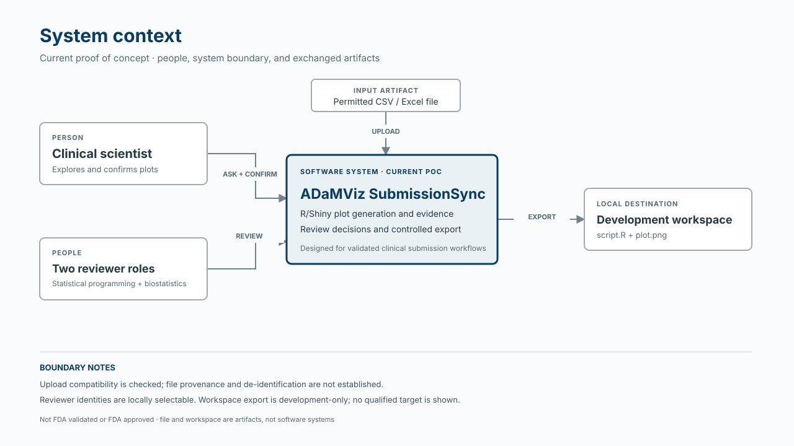
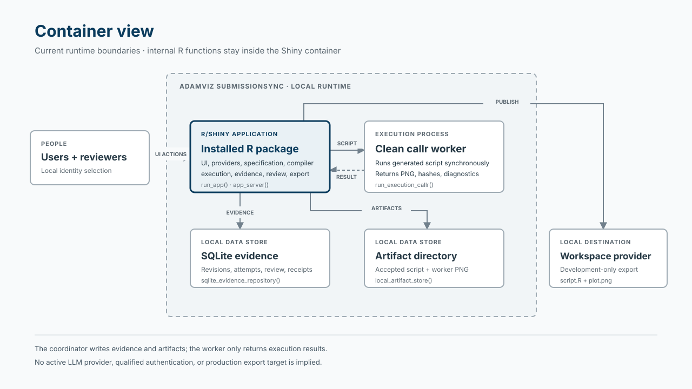
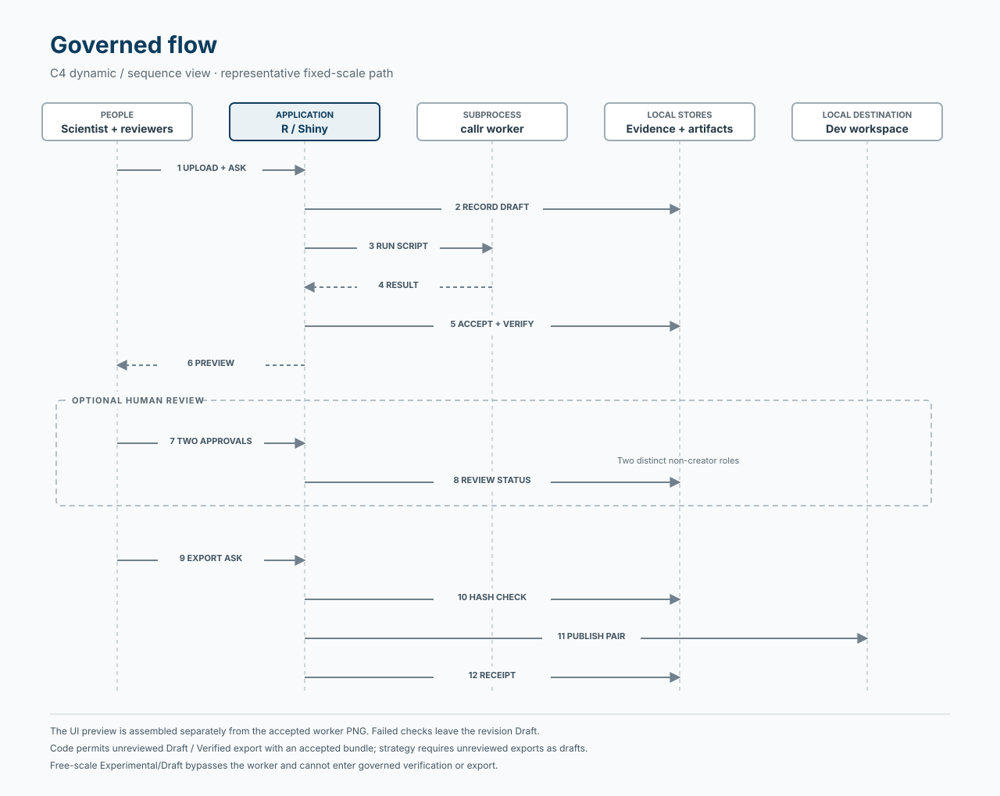

# Architecture

ADaMViz SubmissionSync is an R-first, package-oriented Shiny proof of concept for clinical scientists, supported by statistical programmers and biostatisticians. It connects permitted input data, confirmed plotting choices, generated R code, plot artifacts, automated evidence, reviewer decisions, and export receipts.

It is **designed for validated clinical submission workflows; it is not FDA validated or FDA approved**. Intended-use validation belongs to the regulated organization.

## Diagrams

The diagrams show the current proof of concept. They are visual guides to the code and the implementation limits described below.

**System context** — people, the application, permitted input, and the local development export. [Open full-size view](docs/architecture/system-context.html).

**Container view** — the Shiny application, clean `callr` worker, local stores, and development workspace. [Open full-size view](docs/architecture/container-view.html).

**Governed flow** — a representative fixed-scale sequence, with optional human review and the code's export gate. [Open full-size view](docs/architecture/governed-flow.html).

## Current scope

The implemented plotting pattern is a longitudinal numeric BDS boxplot: one parameter, unit, and stored Y variable (`AVAL`, `CHG`, or `PCHG`), ordered analysis visits, treatment facets, median connections, visible outliers, and distinct-subject N.

The active interface follows **Data → Ask → Confirm → Result → Export**. Inputs are CSV or Excel files; Excel parsing uses the first worksheet. Outputs include a plot preview, generated R script, revision evidence, review history, and a detached `plot.png`/`script.R` export pair with an optional ZIP download.

Implementation exists for deterministic generation, synchronous subprocess execution, local evidence persistence, review, correction revisions, and development-only workspace export. Privacy qualification, production authentication, and qualified target-environment controls are incomplete. A mock prompt interpreter exists separately; the active upload workflow collects the question but derives plotting choices from data and user selections rather than interpreting that question.

Persistent governed study context and broader table, listing, and figure support remain deferred.

## Code map

Names below are exact symbols suitable for IDE symbol search.

| Component / physical location | Responsibility | Start here for common changes |
| --- | --- | --- |
| Root `app.R`; application functions under `R/` | Launch the installed package and compose the Shiny application | `run_app()`, `app_ui()`, `app_server()` |
| `R/mod_*`; `R/app_theme.R`; `inst/app/www/` | Workflow navigation, confirmation, preview, evidence, review, and export interface | `mod_plot_generation_server()`, `mod_specification_server()`, `app_theme()` |
| `R/provider_study_data*`; `R/bds_profile.R`; upload adapter in `R/mod_plot_generation.R` | Read inputs, pin snapshots, expose choices, and validate the supported selected-data envelope | `.uploaded_study_data_provider()`, `pin_study_snapshot()`, `validate_bds_profile()` |
| `R/domain_*`; `R/prompt_*`; canonical serialization | Specification, status, execution contracts, aggregate prompt context, and optional interpretation | `new_plot_spec()`, `confirm_plot_spec()`, `interpret_prompt()`, `canonical_hash()` |
| `R/boxplot_*` | Statistics, plot assembly, and deterministic standalone script generation | `calculate_boxplot_statistics()`, `assemble_boxplot()`, `compile_boxplot_script()` |
| Execution and verification files under `R/` | Coordinate attempts, run the script, check results, and perform separately requested replay | `new_execution_service()`, `run_execution_callr()`, `verify_execution_result()`, `new_reproducibility_service()` |
| Evidence, artifact, lifecycle, review, and export files under `R/`; `inst/sql/` | Persist revision relationships and evidence; govern review and publication | `sqlite_evidence_repository()`, `local_artifact_store()`, `new_review_service()`, `new_export_service()` |
| `tests/testthat/`; `inst/schema/`; `inst/extdata/synthetic/`; `.github/workflows/` | Behavioral tests, contract assets, governed synthetic fixtures, and package CI | Relevant `test-*` files, `synthetic_scenario_manifest()`, `R-CMD-check.yaml` |

These components are conceptual groups within a **flat `R/` directory**, not separate packages or directory layers. Provider contracts are classed lists of functions. The application coordinator currently constructs several local implementations directly.

`app.R` calls the installed namespace. Reading or editing source does not by itself update the installed application.

## End-to-end flow

| Stage | Current implementation |
| --- | --- |
| **1. Input and snapshot — implemented; privacy assurance partial** | `.uploaded_study_data_provider()` parses and checks supported file structure, calculates file/content hashes, and creates provider metadata. `pin_study_snapshot()` checks membership and content identity. Direct uploads carry no classification; format checks do not establish synthetic provenance or de-identification. |
| **2. Plot specification — implemented; interpretation integration partial** | `.create_assurance_candidate()` retains the question and builds aggregate choices. `mod_specification_server()` collects selections; `.confirmed_spec_from_fields()` creates a confirmed specification with provenance. The active path does not call `interpret_prompt()`. `ellmer_prompt_interpreter()` is disabled. |
| **3. Profile and compilation — implemented** | `.execute_assurance_revision()` validates the selected BDS profile before compilation. Explicit selections govern inclusion; analysis flags are not silently applied. Missing selected Y values are excluded from display statistics while retained selected records remain available for evidence. Blocking profile diagnostics stop generation. `compile_boxplot_script()` emits application-owned R code. |
| **4. Execution and artifacts — implemented** | Fixed-scale revisions start as `Draft`. `new_execution_service()` records an attempt and synchronously invokes a clean `callr` subprocess. The worker executes the supplied script with selected records as `analysis_data`, returning analytical output, PNG identity, environment details, and diagnostics. Passing service checks lead to artifact acceptance and `Verified`; failed verification leaves `Draft`. |
| **5. Preview, evidence, and replay — implemented with separate paths** | The UI preview is assembled again in the application process; it does not display the accepted worker PNG. Revision-context evidence retains the question, specification, selected input records, script, execution metadata, and checks. `new_reproducibility_service()` can rerun retained evidence, but replay is not wired into the normal confirmation, review, or export path. |
| **6. Review and correction — implemented with local identities** | Two distinct active non-creator actors, covering statistical-programmer and biostatistician roles, must approve identical artifact hashes to reach `Reviewed`. Rejection creates `Rejected`. Corrections to `Rejected` or `Reviewed` revisions create linked successors with rationale and provenance. UI identities are selectable local actors, not authenticated users. |
| **7. Controlled export — implemented for development** | `new_export_service()` accepts `Draft`, `Verified`, or `Reviewed` revisions with an accepted bundle. It checks actor eligibility, revision version, destination, and artifact hashes around staging/publication, then records an internal receipt. The local provider publishes only `script.R` and `plot.png`; the ZIP packages the last successful export. Qualified target-provider guarantees remain deferred. |

Free Y scales require UI confirmation and produce `Experimental/Draft`. The coordinator generates their script and preview without submitting a governed subprocess attempt. They cannot enter governed verification or controlled export.

## Invariants and dependency boundaries

Enforcement labels describe existing mechanisms and test coverage, not a claim that tests currently pass.

| Boundary | Enforcement and limits |
| --- | --- |
| Only permitted POC data; no confidential patient-level data | **Documented policy only for provenance.** Runtime format/profile checks and automated tests exist, but direct uploads bypass classification and use the execution service’s synthetic default. |
| Secrets stay outside source, prompts, scripts, logs, and retained evidence | **Documented policy**, with **runtime checks + automated tests** for injected secret resolution. There is no demonstrated application-wide secret redaction or subprocess environment allowlist. |
| Prompt/model output must not become arbitrary executable R | **Runtime checks + automated tests** in the interpreter and confirmed-spec compiler. The active UI uses the owned compiler. The runner itself is not a hostile-code sandbox or an independent compiler allowlist. |
| Selected data must fit the supported plotting envelope | **Runtime checks + automated tests** for required fields, selections, visit mappings, duplicate keys, numeric Y, and statistical input checks. `dataset_conformance = "not_assessed"` explicitly avoids claiming full ADaM conformance. |
| `Verified` and human approval remain distinct | **Runtime checks + automated tests** in the execution and review services. Passing execution evidence is enforced by the execution service; repository `mark_verified()` checks status/version but does not require that evidence. |
| Review binds an immutable revision; correction creates a successor | **Runtime checks + automated tests** for reviewer roles, distinct identities, creator exclusion, hashes, stale versions, and correction relationships. Pending image/analytical hashes are bound once during artifact acceptance. |
| Evidence and artifacts retain identity | **Runtime checks + automated tests** for content-addressed artifacts, SQL relationships, command idempotency, lifecycle hash chains, integrity checking, and backup/restore. This is local integrity machinery, not qualified audit-record custody. |
| Replay preserves recorded identity | **Runtime checks + automated tests** in the separately callable replay service. Image equality depends on matching environment fingerprints. Replay is not an automatic review/export prerequisite. |
| Export uses accepted artifacts and registered logical destinations | **Runtime checks + automated tests** in export/workspace services. `Experimental/Draft` and `Rejected` are excluded. The development provider does not supply qualified filesystem or access-control guarantees. |
| Stay within approved ggplot scope and R-based AI implementation | **Documented policy only** in `CODEX_CONTEXT.md`; no dependency-direction linter or CI architecture rule was found. |

The worker returns execution results; the coordinating process writes evidence. Future model adapters must remain on the specification side of the compiler boundary and must not gain execution, review, or workspace-publication authority.

## Cross-cutting concerns

**Configuration and injection.** `new_runtime_config()` provides profile and logical provider/workspace identifiers plus an injected secret resolver. Services accept repository, runner, identity, artifact, and workspace implementations. Injection is partial at application level: the coordinator constructs local providers, and runtime prompt-provider selection does not select an interpreter in the active workflow. `get_golem_config()` exists separately from these runtime defaults.

**Errors and recovery.** Boundaries use `checkmate` and `cli`; modules expose caught errors as messages. Execution failures produce failed results and terminal attempt evidence. `reconcile_execution_attempts()` and `reconcile_workspace_exports()` exist as callable recovery functions, without automatic application startup wiring.

**Observability and cancellation.** Stored attempts, timestamps, checks, review decisions, receipts, and worker diagnostics provide operational evidence. The subprocess has a timeout. No user cancellation control or strategy-metric telemetry pipeline was found; schema outcome names such as `cancelled` do not establish cancellation behavior.

**Testing and continuous checks.** Tests cover functions, contracts, services, Shiny servers, and browser journeys. Browser initialization can skip when unavailable. CI documents the package, runs tests, and runs `R CMD check`. Its failure threshold is errors; repository pre-commit policy additionally requires formatting, linting, and failure on warnings.

## Contradictions and open questions

1. **Data boundary:** strategy permits public, synthetic, or properly de-identified data; the F001 design learning specifies synthetic-only use. Upload checks establish compatibility, not provenance. Which approved boundary and enforcement apply?
2. **Authentication:** UX and threat-model wording assumes authenticated/session-derived actors; the current UI selects local identities.
3. **Export semantics:** strategy requires unreviewed exports to be drafts; UX describes post-approval eligibility. Code permits unreviewed `Verified` export and omits status from detached files.
4. **Verification meaning:** runtime verification checks execution identity and manifest/hash properties. It does not independently establish statistical correctness or automatically rerun the revision. Repository-level promotion can bypass service evidence.
5. **Artifact identity:** the preview is reconstructed rather than read from the accepted PNG. The “Executed R script” label also appears for experimental revisions that were not submitted to the worker.
6. **Standalone portability:** generated scripts contain a checkout-specific fallback data path and package-installation code. This differs from documentation saying detached files omit internal paths; locked-environment replay depends on supplying the retained selected records.
7. **Persistence and operations:** the app creates evidence under temporary directories. Retention custody, cross-session discovery, automatic recovery, production monitoring, and target-environment qualification remain unsettled.
8. **Document drift:** workflow/product documents leave lifecycle and supported-envelope questions open despite implemented choices; the traceability matrix still marks implemented areas as planned. The readiness report places `STRATEGY.md` at root, but its actual location is `docs/product/STRATEGY.md`.

These observations identify differences; they do not authorize new requirements or refactoring.

## Navigation and maintenance

The [twelve feature guides](docs/features/README.md) explain the current input,
profiling, plotting, execution, review, export, and evidence workflows. Each guide
includes an implementation diagram and links to source and inspected tests.

| Task | Read before changing it |
| --- | --- |
| Scope, terminology, or product boundaries | `CODEX_CONTEXT.md`, `docs/product/STRATEGY.md`, `docs/product/product-contract.md`, `CONCEPTS.md` |
| UI or workflow behavior | `R/AGENTS.md`, `docs/ux/F001-plot-generation.md`, relevant `docs/solutions/`; compare the prototype for layout |
| Statistics, specification, or execution | `R/AGENTS.md`, relevant implementation/tests, and `docs/plans/2026-09-06-0014-feat-plot-pattern-assurance-cell-plan.md` for design intent |
| Privacy, review, evidence, export, or deployment boundaries | Relevant code/tests and `docs/validation/`, especially the threat model, retention, traceability, and target-environment protocol |
| Test or verification changes | `tests/AGENTS.md` and the relevant test family |

Plans, explainers, prototypes, and validation templates describe intent or recorded evidence; they do not override inspected behavior or establish qualification.

Update this map when entry points, component responsibilities, data flow, provider boundaries, persistence, execution, review, or export eligibility change. Keep package versions, thresholds, UI details, test counts, and operational settings in code or nearby detailed documents.
