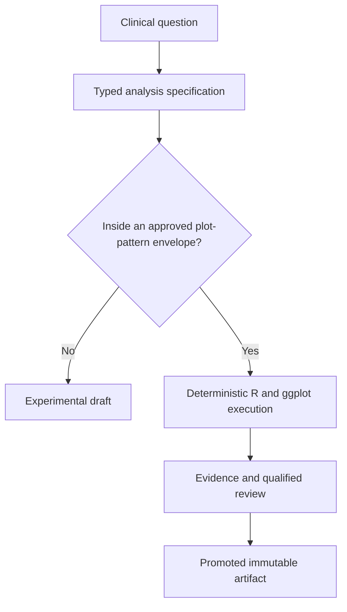

# Ideation: ADaMViz SubmissionSync as a Validation-Ready Product

## Grounding Context

ADaMViz SubmissionSync is positioned as a conversational ADaM-to-`ggplot2` product for clinical scientists, with inspectable R code, controlled execution, reproducibility, and qualified statistical review.
Its defensible promise is submission-oriented trust, not unconstrained chart generation and not automatic validation.

The strategy establishes hard boundaries: the POC uses only public, synthetic, or properly de-identified data; unreviewed outputs remain drafts; confidential patient-level data is prohibited until applicable controls are qualified and client use is approved; and broader TLF support is deferred.
The GxP reference adds a strong architectural principle: application logic should be independent of environment-specific services, with a local synthetic provider and production provider governed by the same versioned contract.

The important product gaps are concrete.
There is no implemented analysis specification, semantic provider contract, scenario catalog, evidence schema, promotion lifecycle, reviewer workflow, or evaluation protocol yet.
The strategy's 80% first-pass-quality and reproducibility targets also lack defined datasets, scoring rules, reviewer calibration, and denominator rules.

External grounding strengthens a compiler-oriented direction.
[CDISC ARS](https://www.cdisc.org/standards/foundational/analysis-results-standard) provides precedent for machine-readable analysis and output metadata; [CDISC CORE](https://www.cdisc.org/core) provides precedent for executable governed conformance rules; and [FDA Standard Safety Tables and Figures](https://www.fda.gov/drugs/development-resources/standard-safety-tables-and-figures-stfs) provides regulator-authored safety display patterns.
Existing R ecosystems such as [`teal`](https://pharmaverse.github.io/blog/posts/2024-07-22_teal_app_development_pharmaverseadam/teal-app-development.html) and [`safetyGraphics`](https://github.com/SafetyGraphics/safetyGraphics) demonstrate reproducible ADaM exploration and safety visualization, but the reviewed sources did not show the complete combination of conversational intent capture, typed clinical semantics, deterministic execution, evidence lineage, and governed approval.
[FDA electronic-record guidance](https://www.fda.gov/regulatory-information/search-fda-guidance-documents/electronic-systems-electronic-records-and-electronic-signatures-clinical-investigations-questions) and [EMA computerized-systems guidance](https://www.ema.europa.eu/en/documents/regulatory-procedural-guideline/guideline-computerised-systems-and-electronic-data-clinical-trials_en.pdf) are relevant controls context, but they do not prescribe this product architecture or validate it.

No repo-local `solutions/` learning corpus exists, so the ideas below are proposed directions rather than established implementation patterns.

---

## Topic Axes

- Statistical intent and visualization correctness
- Data/provider contract and governed synthetic scenarios
- Controlled execution and environment equivalence
- Evidence, traceability, and lifecycle status
- Qualified review workflow and user adoption

---

## Ranked Ideas

- [Ideation: ADaMViz SubmissionSync as a Validation-Ready Product](#ideation-adamviz-submissionsync-as-a-validation-ready-product)
  - [Grounding Context](#grounding-context)
  - [Topic Axes](#topic-axes)
  - [Ranked Ideas](#ranked-ideas)
    - [1. Plot-Pattern Assurance Cell](#1-plot-pattern-assurance-cell)
    - [2. Typed Clinical Claim Compiler](#2-typed-clinical-claim-compiler)
    - [3. Semantic Provider Contract Airlock](#3-semantic-provider-contract-airlock)
    - [4. Adversarial Synthetic Scenario Forge](#4-adversarial-synthetic-scenario-forge)
    - [5. Twin-Run Equivalence Witness](#5-twin-run-equivalence-witness)
    - [6. Evidence Graph and Plot Passport](#6-evidence-graph-and-plot-passport)
    - [7. Exception-Led Review Learning Loop](#7-exception-led-review-learning-loop)
  - [Rejection Summary](#rejection-summary)

### 1. Plot-Pattern Assurance Cell

**Description:** Make the primary governed product unit a supported plot pattern with an explicit approved envelope.
Each cell contains the typed clinical intent it accepts, semantic rules, provider requirements, signed plotting primitives, foreseeable misuse, synthetic challenge scenarios, checks, residual limitations, and approval record.
An output inherits the cell's evidence only when its exact specification and execution remain inside that envelope; anything novel remains Experimental or Draft.

**Axis:** Statistical intent and visualization correctness, with cross-cutting validation leverage.

**Basis:** `direct:` `STRATEGY.md:32-39` limits unevaluated patterns and the POC surface; `STRATEGY.md:62-85` makes statistical appropriateness, controlled execution, evaluation, and qualified review the trust foundation; `docs/references/gxp-coding-agent-guidance.md:79-105` requires risk-based testing, traceability, evidence states, and per-output evidence.

**Rationale:** This is the strongest strategic unit because it turns a broad product promise into a finite portfolio of evidence-bearing capabilities.
It also prevents a common validation failure: assuming that testing the application once makes every future generated figure equally supported.

**Downsides:** High upfront design and governance cost; risks becoming bureaucratic if the first catalog is too broad; requires clear ownership for approving and changing each envelope.

**Confidence:** 91%

**Complexity:** High

### 2. Typed Clinical Claim Compiler

**Description:** Treat natural language as proposal text, not executable logic.
The model produces a typed, human-readable analysis specification containing population, endpoint or parameter, denominator, grouping, time window, missing-data handling, statistic, uncertainty, display intent, and unresolved decisions.
A deterministic compiler validates that object against governed rules and emits inspectable R; unsupported or ambiguous intent fails before execution.

**Axis:** Statistical intent and visualization correctness.

**Basis:** `direct:` `STRATEGY.md:40-43` prohibits invented business or environment assumptions; `STRATEGY.md:62-76` requires statistically appropriate plots and controlled reproducible execution; `docs/references/gxp-coding-agent-guidance.md:17-29` requires material assumptions and clarifications to become reviewable artifacts. `external:` CDISC ARS provides a credible machine-readable analysis-metadata analogue, but not a ready-made natural-language compiler contract.

**Rationale:** The clinical meaning becomes stable and reviewable before code or pixels can conceal ambiguity.
The same specification can drive generation, testing, review, traceability, and later ARS mapping, creating more leverage than improving prompts alone.

**Downsides:** Very high semantic-design burden; efficacy questions can expand the grammar rapidly; deterministic code generation still needs careful versioning and escape handling; the under-one-minute metric is unproven for ambiguity-heavy requests.

**Confidence:** 90%

**Complexity:** High

### 3. Semantic Provider Contract Airlock

**Description:** Upgrade “same response shape” into a versioned clinical-semantic contract.
The contract covers physical schema, labels, controlled terminology, keys and relationships, variable roles, units, population applicability, lineage, and declared failure behavior.
The validated environment exports a participant-free signed contract bundle one way; local development imports it to generate mocks and run the same consumer conformance suite without any route back to production data.

**Axis:** Data/provider contract and governed synthetic scenarios.

**Basis:** `direct:` `docs/references/gxp-coding-agent-guidance.md:31-43` requires injected services, contract-compatible mocks, common application paths, production isolation, and representative failure checks; `docs/references/gxp-coding-agent-guidance.md:59-67` requires documented schema and controlled terminology; `STRATEGY.md:34-37` prohibits confidential patient data in the POC.

**Rationale:** Two providers can return identically typed tables while differing in clinical meaning.
This idea protects the boundary most likely to produce a plausible but wrong visualization and makes local agent development useful without extending the production trust boundary.

**Downsides:** Very high integration and governance cost; signing and export procedures need a threat model; derivation lineage and semantic roles may vary across sponsors; contract ownership must be explicit.

**Confidence:** 88%

**Complexity:** High

### 4. Adversarial Synthetic Scenario Forge

**Description:** Treat synthetic data as executable requirements rather than realistic demonstration data.
For every clinical rule and plot-pattern risk, maintain minimal, seeded passing and failing capsules for denominator traps, missing baseline, partial dates, duplicate keys, unit drift, sparse arms, visit ordering, longitudinal discontinuity, controlled-terminology drift, and cross-domain inconsistency.
Each scenario records its purpose, generator version, expected statistical behavior, expected display consequence, and prohibited interpretation.

**Axis:** Data/provider contract and governed synthetic scenarios.

**Basis:** `direct:` `docs/references/gxp-coding-agent-guidance.md:59-71` explicitly requires governed, reproducible boundary, missingness, longitudinal, cross-domain, and failure scenarios while warning that synthetic data cannot represent all real-study variation; `docs/references/gxp-coding-agent-guidance.md:79-84` prioritizes requirements and risks over raw coverage percentage.

**Rationale:** A small counterexample that diagnoses one clinical rule is more valuable than a large synthetic dataset with unclear coverage.
The scenario library also becomes common currency across prompt evaluation, compiler testing, provider conformance, regression testing, and client demonstrations.

**Downsides:** High expert-maintenance cost; scenario coverage can create false confidence if not paired with approved-data testing; expected visual behavior may be difficult to encode without brittle pixel snapshots.

**Confidence:** 92%

**Complexity:** Medium

### 5. Twin-Run Equivalence Witness

**Description:** Execute one frozen analysis specification and evidence package through the local synthetic provider and the controlled target provider.
Compare contract versions, schema validation, normalized intermediate results, generated code identity, warnings, dependency manifests, rendering configuration, and output fingerprints.
Produce a signed witness of matches and justified differences; any unexplained semantic difference blocks promotion without claiming that local success validates production.

**Axis:** Controlled execution and environment equivalence.

**Basis:** `direct:` `docs/references/gxp-coding-agent-guidance.md:31-46` requires a shared application path but explicitly says local execution does not replace qualified-environment testing; `docs/references/gxp-coding-agent-guidance.md:119-121` requires separately planned and recorded target testing; `STRATEGY.md:54-56` measures exact reproduction through controlled re-execution.

**Rationale:** This converts the diagram's architectural claim into objective evidence.
It also makes environment divergence diagnosable rather than burying it in two unrelated test reports.

**Downsides:** Very high operational cost; true data values may legitimately differ between synthetic and target runs, so comparison needs carefully selected invariants; stable plot fingerprints require normalization; no representative target environment currently exists.

**Confidence:** 86%

**Complexity:** High

### 6. Evidence Graph and Plot Passport

**Description:** Represent every visualization as an immutable lineage graph linking requirement, typed specification, prompt/model version, provider contract, input snapshot, compiled R, package environment, checks, output hash, reviewer decisions, and status history.
Export a compact human- and machine-readable passport with the plot.
Dependency changes surgically invalidate affected evidence and return impacted outputs to the appropriate non-approved state; unchanged evidence remains reusable.

**Axis:** Evidence, traceability, and lifecycle status.

**Basis:** `direct:` `docs/references/gxp-coding-agent-guidance.md:89-105` defines evidence states and the required per-visualization evidence bundle; `docs/references/gxp-coding-agent-guidance.md:123-126` names the controlled change surface; `STRATEGY.md:103-107` promises alignment among prompt, input, code, output, review status, and evidence. `external:` FDA electronic-record guidance is relevant controls context but does not itself prescribe passports or dependency graphs.

**Rationale:** This makes validation evidence a product object rather than an after-the-fact document hunt.
It also solves a costly lifecycle problem: deciding which outputs need re-verification after a package, prompt, contract, model, or environment change.

**Downsides:** Very high data-model and governance complexity; immutable evidence storage, retention, signatures, access control, and audit review need separate requirements; graphs can overwhelm users without role-specific views.

**Confidence:** 89%

**Complexity:** High

### 7. Exception-Led Review Learning Loop

**Description:** After each refinement, present qualified reviewers with a semantic delta: changed intent fields, filters, derivations, plot mappings, code, evidence, failed rules, and novelty.
Capture every material correction as a governed semantic patch linked to a scenario and risk class; after separate approval, it becomes a reusable check and regression capsule for future outputs.
Clinical-intent and statistical/evidence decisions remain attributable, and the system never self-approves.

**Axis:** Qualified review workflow and user adoption.

**Basis:** `direct:` `STRATEGY.md:49-58` requires recorded reviewer decisions, at least 80% first-pass acceptance, exact reproducibility, and sub-minute reviewed output; `STRATEGY.md:78-85` makes evaluation and qualified review central; `docs/references/gxp-coding-agent-guidance.md:79-87,101-105,125-126` supports requirement-based tests, reviewed expected results, status history, and controlled rule changes.

**Rationale:** Reviewer attention is the scarce resource.
This idea concentrates it on material novelty while converting expert corrections into durable, governed evaluation assets instead of opaque prompt tweaks or uncontrolled model learning.

**Downsides:** High workflow-design cost; semantic differencing is only trustworthy if the underlying specification is typed; reviewer patches can encode sponsor-specific conventions and therefore require scope metadata, calibration, and explicit promotion controls.

**Confidence:** 87%

**Complexity:** High

---

## Rejection Summary

| # | Idea | Reason Rejected |
|---|---|---|
| 1 | Clinical Semantic Type System | Basis was weaker than the full compiler case, and the useful semantics are a required compiler component rather than an independent direction. |
| 2 | Finite Signed Plot Grammar | Sound, but substantially absorbed by the stronger Plot-Pattern Assurance Cell, which adds risks, scenarios, limitations, and approval evidence. |
| 3 | Assumption Escrow and Ambiguity Budget | Sound interaction pattern, but it belongs inside the Typed Clinical Claim Compiler rather than defining a separate product direction. |
| 4 | Contract Mutation Clinic | Actionable testing technique, but subordinate to the Semantic Provider Contract Airlock and Scenario Forge. |
| 5 | Synthetic-Only Validation Studio | Weakly supported as a lifecycle product and the name risks implying that synthetic evidence alone establishes validation. |
| 6 | Independent Reproduction Quorum | Two clean workers may reproduce the same defect; the arbitrary quorum adds cost without a risk-based rationale and overlaps the stronger cross-environment witness. |
| 7 | Reproducibility Divergence Classifier | Useful diagnostic capability, but best implemented inside the Twin-Run Equivalence Witness rather than pursued independently. |
| 8 | Figure Flight Recorder | Sound chronology view, but it is a presentation and replay capability of the Evidence Graph and Plot Passport. |
| 9 | Draft-Only Export Capability | Important safety control, but below the ambition floor as a standalone direction and naturally enforced by the Plot Passport lifecycle. |
| 10 | Two-Key Risk-Allocated Review | Distinct approvals are useful policy, but the evidence does not yet establish a universal two-signature rule; attribution and risk routing are retained in the review loop. |
| 11 | Trust Promotion Pipeline | Sound umbrella workflow, but too broad and duplicative to rank beside its more actionable components. |
| 12 | Governed Reviewer Patch Library | Near-duplicate of the broader Exception-Led Review Learning Loop, which also covers semantic deltas and scenario conversion. |
| 13 | Plot Evidence Receipt | Duplicate of the stronger Evidence Graph and Plot Passport, which includes invalidation and reuse mechanics. |
| 14 | Review the Delta, Not the Whole Plot | Duplicate of the stronger Exception-Led Review Learning Loop, which adds governed learning and regression evidence. |

