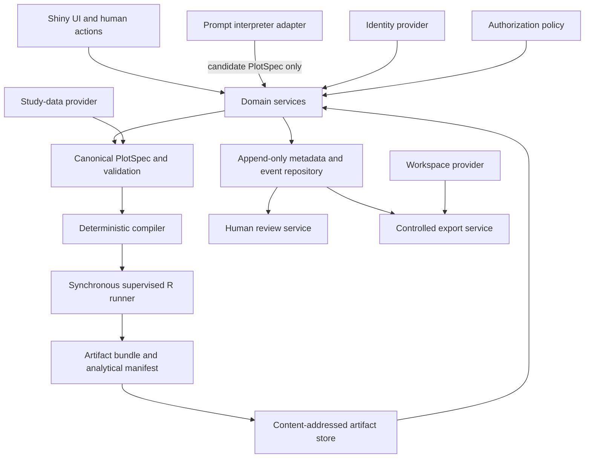
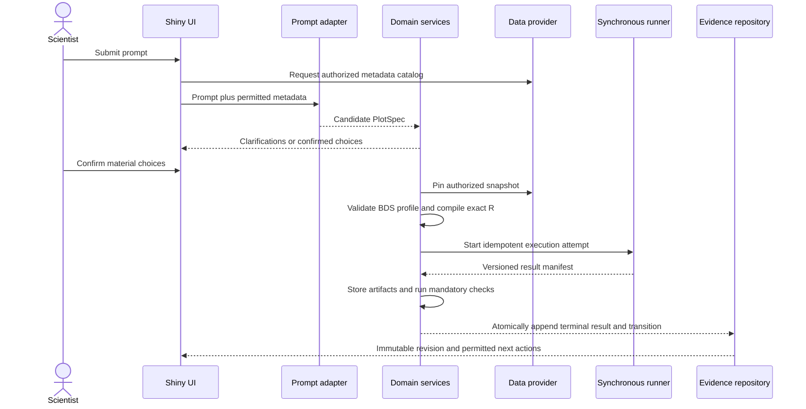
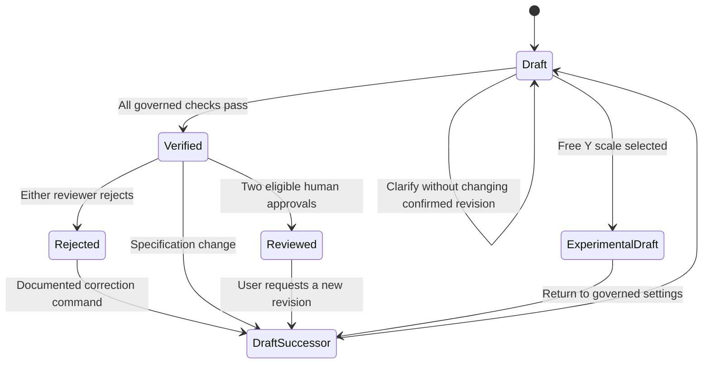
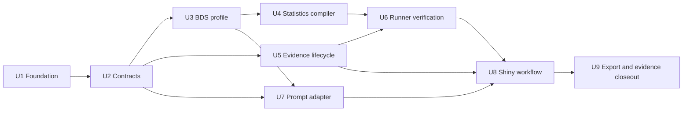

# Plot-Pattern Assurance Cell - Plan

## Goal Capsule

**Objective:** Let a clinical scientist describe a longitudinal boxplot in natural language and receive a statistically checked plot plus inspectable, reproducible R code for a supported ADaM BDS dataset.

**Means:** Implement the first governed Plot-Pattern Assurance Cell as one package-oriented Shiny application with a canonical specification, deterministic R compiler, injected providers, controlled execution, immutable evidence, and human review gates (KTD1-KTD15).

**Success signal:** The product reaches `Verified` from a prompt in a median of under one minute, then records the separate human-review interval required to reach `Reviewed`.

**Authority:** [Product strategy](../product/STRATEGY.md) defines the product positioning, users, boundaries, metrics, and investment tracks. This contract refines the first plot pattern without changing those commitments.

**Execution profile:** Reconcile this plan against the existing R package and Shiny application. Use only public, synthetic, or properly de-identified data during the POC. Add dependencies only after explicit user approval and lock the accepted set with `renv`.

**Stop conditions:** Stop the affected flow when a material plot choice is unresolved, the selected data fail the supported visit-based BDS profile, a required provider is unavailable, a stale revision token is presented, or an actor lacks permission. Do not represent local or CI evidence as qualified-target-environment validation.

**Tail ownership:** The product team owns code and automated evidence. The sponsor quality system owns intended use, identity qualification, reviewer authorization, controlled-workspace approval, target-environment qualification, UAT, release authorization, retention, and change control.

## Product Contract

### Summary

Implement the first Assurance Cell as one package-oriented Shiny application. A provider-neutral prompt interpreter proposes a canonical plot specification, while deterministic domain services own validation, statistics, R-code compilation, execution, evidence, review, and export. The plan covers the full governed boxplot scope and defers arbitrary R transformations and post-`Reviewed` withdrawal handling.

### Problem Frame

Clinical scientists can already ask an LLM for plotting code, but the resulting code may hide unresolved choices about records, visits, units, denominators, missingness, treatment groups, and display behavior. Moving between chat and R also weakens the connection among the original request, executed code, rendered plot, checks, and review decisions.

The first Assurance Cell makes that connection explicit for a narrow, recurring clinical display. It accepts only data and choices that fit its declared envelope, stops when the structure is ambiguous or unsupported, and preserves the evidence needed to reproduce and review every revision.

### Actors

- A1. **Clinical scientist:** Enters the prompt, supplies or selects the permitted ADaM BDS dataset, resolves prompted choices, inspects the result, and requests review or revision.
- A2. **Statistical programmer:** Independently assesses data handling, ADaM semantics, calculations, R code, and reproducibility for every plot revision submitted for review.
- A3. **Biostatistician:** Independently assesses the statistical and clinical appropriateness of every plot revision submitted for review.
- A4. **Assurance system:** Converts intent into a constrained specification, validates the supported envelope, executes deterministic R code in a controlled environment, records evidence, and enforces lifecycle rules.
- A5. **Controlled workspace:** The only permitted destination for exported plot images and R code.

### Key Decisions

- **Prompt-first experience.** The Assurance Cell remains behind the conversational interface rather than becoming configuration-only. Governs R1-R2. (session-settled: user-directed — chosen over a form-only workflow: the product starts from a user prompt)
- **Catalog, then first pattern, then review workbench.** The boxplot is the first catalog pattern; broader reviewer tooling follows later. Governs R1-R40. (session-settled: user-directed — chosen over building the full catalog or review workbench first: deliver one governed pattern before expansion)
- **One visit-based numeric BDS profile.** The selected records must fit one record per subject, parameter, and analysis visit; failure means unsupported profile, not automatic ADaM nonconformance. Governs R3-R15. (session-settled: user-directed — chosen over accepting repeated visit records: ambiguous record structures stop execution)
- **Stored values without hidden filtering.** Use one `PARAMCD`, one `AVALU`, one selected Y variable, all selected parameter records, and no implicit population or analysis flag. Governs R3-R10. (session-settled: user-directed — chosen over implicit population filtering or aggregation: source values remain visible and reviewable)
- **Governed Tukey display.** Use native R/ggplot2 quantile type 7, visible outliers, connected displayed medians, fixed scales by default, and an aligned distinct-subject N strip. Governs R16-R24. (session-settled: user-directed — chosen over SAS-compatible type 2 and alternative N placements: use native ggplot2 semantics and the selected option C layout)
- **Free-scale downgrade.** Free Y scales create `Experimental/Draft` and cannot inherit governed evidence. Governs R25, R29-R30, R38. (session-settled: user-directed — chosen over treating free scales as governed by default: cross-facet comparison is weakened)
- **Arbitrary R deferred.** The first release does not accept or execute arbitrary R transformations. Governs R26-R28. (session-settled: user-directed — chosen over adding a sandboxed transformation path now: defer the security-critical surface)
- **Two independent human approvals.** `Reviewed` requires distinct authenticated statistical-programmer and biostatistician identities, and neither may be the revision creator. Governs R31-R35. (session-settled: user-approved — chosen over role-only approval: independent review must be attributable)
- **Controlled export matrix.** `Draft`, `Verified`, and `Reviewed` may export a complete accepted artifact bundle only to the controlled workspace; `Experimental/Draft` may not export. Governs R38-R40. (session-settled: user-approved — chosen over unrestricted status export: experimental results remain contained)
- **Layered reproducibility.** Specification, code, and analytical results are exact; image bytes are exact only within the pinned rendering environment. Governs R36-R37. (session-settled: user-approved — chosen over universal pixel identity: rendering depends on the qualified environment)
- **Post-review withdrawal deferred.** The first release does not add withdrawal or supersession behavior for a later-discovered defect. Governs the follow-up boundary. (session-settled: user-directed — chosen over expanding the first lifecycle: revisit after the initial review flow works)

<!-- ce-section: work-relationships -->
### How This Work Fits Together

1. **Catalog boundary:** Define the common contract every supported plot pattern must carry: accepted intent, supported data envelope, deterministic output rules, checks, limitations, lifecycle, and evidence.
2. **First supported pattern:** Apply that contract to the longitudinal treatment-faceted boxplot defined here and use it to prove the prompt-to-`Verified` workflow.
3. **Reviewer-centered expansion:** After the first pattern is stable, broaden the workbench for comparison, correction, review, and reuse across additional governed patterns.

The first pattern must therefore be useful on its own while leaving its assurance concepts reusable. It must not require the full future catalog or review workbench to deliver the initial value.

### Requirements

#### Prompt and specification

- R1. The user can enter a natural-language request and receive a plot plus the exact R code used to generate it.
- R2. Before execution, the system represents the resolved request as an inspectable specification and asks the user to resolve any material choice that the prompt and data do not determine safely.
- R3. The first cell supports exactly one selected `PARAMCD` per plot revision.
- R4. The user selects exactly one Y variable from those present and eligible among `AVAL`, `CHG`, and `PCHG`.
- R5. The selected Y values are plotted exactly as stored by default; no implicit transformation, imputation, aggregation of source records, or population filtering is allowed.
- R6. When the selected parameter contains more than one non-missing `AVALU`, the user selects exactly one unit before execution.
- R7. The user selects an eligible treatment variable for faceting. Every observed level is included by default, and the user may exclude levels.
- R8. Every eligible analysis visit is included by default, and the user may exclude visits.

#### Data-envelope checks

- R9. The selected records come from a permitted, conforming ADaM BDS dataset and include the variables needed for the resolved specification.
- R10. The cell uses all records for the selected parameter, unit, treatment levels, and visits. It does not silently filter by a population flag, `ANL01FL`, or another analysis flag.
- R11. For the supported envelope, there is at most one record for each `USUBJID`–`PARAMCD`–analysis-visit combination after the explicit selections are applied.
- R12. If R11 fails, the system highlights the duplicate key values, explains that the selected structure is unsupported by this cell, and stops before plot generation.
- R13. `AVISITN` determines visit order. Missing, conflicting, or non-unique `AVISIT`/`AVISITN` mappings that prevent a deterministic order stop execution and are shown to the user.
- R14. Records with a missing selected Y value do not contribute to a box, median, outlier, or N.
- R15. If a treatment–visit combination has no non-missing selected Y value, that combination has no box, median point, or N entry in that treatment facet.

#### Statistical and visual behavior

- R16. Each displayed box uses native R/ggplot2 quantile type 7: box from Q1 to Q3, median line, whiskers extending to the most extreme observations within 1.5 IQR of the hinges, and visible observations beyond the whiskers.
- R17. The X axis displays `AVISIT` in `AVISITN` order; the Y axis displays the selected `AVAL`, `CHG`, or `PCHG` and the selected `AVALU` where applicable.
- R18. The plot is faceted by the selected treatment variable, with included treatment levels presented consistently.
- R19. Y scales are fixed across treatment facets by default so treatment distributions remain visually comparable.
- R20. A median point is calculated for each displayed treatment–visit box, and a line connects all remaining displayed medians within each treatment facet in visit order.
- R21. N for each box is the distinct count of `USUBJID` values with a non-missing selected Y value in that treatment–visit combination.
- R22. Exact N values appear in a dedicated aligned strip below each treatment plotting panel, rather than inside or above the boxes.
- R23. A displayed box with `N < 5` receives a visible low-sample warning without being suppressed.
- R24. The low-sample threshold defaults to 5 and may be replaced only by a sponsor-approved threshold whose value, rationale, authority, and version are retained with the revision evidence.

#### Optional out-of-envelope behavior

- R25. The user may request free Y scales. Selecting them creates a new `Experimental/Draft` revision and clearly warns that cross-facet visual comparison is weakened.
- R26. Arbitrary R transformations are deferred and are not accepted or executed in the first release.
- R27. The first release generates only the governed operations represented by the canonical boxplot specification.
- R28. A future arbitrary-transformation capability requires a separately threat-modeled external sandbox and a new governed product contract before implementation.

#### Lifecycle, review, and revisions

- R29. Every generated result begins as `Draft` or `Experimental/Draft` and is associated with one logical plot record and one immutable revision identifier.
- R30. Passing all automated data-envelope, statistical, rendering, code, and reproducibility checks changes an eligible Draft revision to `Verified`; it does not imply human approval or product validation.
- R31. Every plot revision requires approval from two distinct authenticated people, one statistical programmer and one biostatistician, and neither may be the revision creator.
- R32. Each reviewer decision records reviewer identity, role, timestamp, revision identifier, decision, and comments or rationale required by the review procedure.
- R33. If either reviewer rejects a revision, an immutable rejection decision is appended and that revision can never become `Reviewed`. A documented correction creates a separate Draft successor revision, which must pass checks and both reviews again.
- R34. Reviewed R code cannot be edited. Any change to the prompt, specification, data selection, code, plot options, or governed threshold creates a new Draft revision while preserving prior history.
- R35. One logical plot record retains append-only version history, including rejected and superseded revisions; evidence and status are revision-specific and are never overwritten.

#### Evidence and export

- R36. Internal revision evidence retains the prompt, resolved specification, permitted input-data identity and metadata, generated R code, execution environment and package versions, checks and results, rendered-output identity, warnings, lifecycle transitions, and reviewer decisions.
- R37. The system reproduces the canonical specification, generated R code, and analytical results exactly; image bytes must match only within the same pinned R, package, operating-system, font, graphics-device, and system-library environment.
- R38. A `Draft`, `Verified`, or `Reviewed` revision may export only when it has one complete accepted image/code artifact bundle whose stored hashes still match and the acting user remains authorized for that revision and destination at publication time. `Experimental/Draft` revisions may not export.
- R39. An export contains only the plot image and its R code. Status, approved scope, reviewer details, and other evidence metadata are not embedded in those exported files.
- R40. Removing status and scope from the export does not remove or weaken the internal evidence, access controls, audit history, or linkage between the exported artifacts and their source revision.

### Key Flows

- F1 — Prompt to Draft: The clinical scientist enters a prompt. The system resolves the single parameter, Y variable, unit, treatment facet, treatment levels, and visits, asking for choices when needed, then presents the inspectable specification.
- F2 — Envelope validation: The system validates required variables, parameter and unit selections, `AVISIT`/`AVISITN` ordering, supported record uniqueness, non-missing data, and treatment/visit availability. A blocking failure stops execution with actionable detail.
- F3 — Draft generation: For eligible data, the system produces deterministic R code, executes it in the controlled environment, and displays the faceted Tukey boxplot with connected medians and the aligned N strip.
- F4 — Automated verification: The system runs the governed checks and records their evidence. An eligible passing revision becomes `Verified`; an unsuccessful revision remains Draft with diagnostics.
- F5 — Qualified review: The same immutable Verified revision is independently reviewed by a statistical programmer and biostatistician. Two approvals produce `Reviewed`. Either rejection closes and preserves that revision; a later correction command with documented rationale creates a successor Draft.
- F6 — User refinement: A permitted selection or wording change creates a new Draft revision. Free-scale requests create an `Experimental/Draft` revision, while arbitrary-R requests are rejected as deferred; neither alters the prior revision.
- F7 — Controlled export: An authorized user exports the plot image and R code to the controlled workspace. The exported files omit status and scope information, while the internal record retains complete evidence.

### Acceptance Examples

- AE1 — Standard happy path: Given a conforming ADLB subset with one record per subject and visit for one selected `PARAMCD` and `AVALU`, when the user chooses `AVAL`, a treatment variable, all levels, and all visits, then the system generates treatment facets in `AVISITN` order, standard Tukey boxes with outliers, connected displayed medians, and exact distinct-subject N values in the lower strip.
- AE2 — Multiple units: Given a selected parameter with two non-missing `AVALU` values, when the prompt does not specify a unit, then the system asks the user to select one and does not execute until one unit is resolved.
- AE3 — Duplicate subject visit: Given two selected records for the same `USUBJID`, `PARAMCD`, and analysis visit, when validation runs, then the system identifies the duplicate key and stops before generating code or a plot for that revision.
- AE4 — Missing Y and sparse data: Given six subjects at a visit but only four with non-missing selected Y values, then the box uses those four values, displays `N=4`, and shows the low-sample warning. The two missing records do not contribute.
- AE5 — Empty treatment visit: Given no non-missing selected Y values for one visit in one treatment group, then that facet shows no box, median, or N for the combination, and its median line connects the other displayed visits in order.
- AE6 — Visit exclusions: Given all eligible visits are initially included, when the user excludes visits, then the plot, medians, N strip, code, and recorded specification all use the same remaining visit set in `AVISITN` order.
- AE7 — Free scale: Given a fixed-scale Draft, when the user chooses free Y scales, then a new revision is created, marked `Experimental/Draft`, and accompanied by a warning about reduced cross-facet comparability.
- AE8 — Arbitrary transformation: Given any selected Y variable, when the user requests an arbitrary R transformation, then the system explains that the capability is deferred, creates no executable specification or revision, and preserves the prior revision unchanged.
- AE9 — Review rejection: Given a Verified revision, when either required reviewer rejects it, then the immutable rejection is retained and that revision cannot receive further review decisions or become Reviewed. After a correction rationale is documented, a separate successor Draft is created and repeats verification and both reviews.
- AE10 — Reviewed immutability: Given a Reviewed revision, when any editable input or generated code would change, then the Reviewed revision remains immutable and the proposed change starts a new Draft revision.
- AE11 — Export boundary: Given a Reviewed, Verified, or permitted Draft revision with a complete accepted image/code bundle, when an authorized export targets an approved controlled workspace, then that exact pair is published and receipted. A missing or mismatched bundle, unresolved export, stale authorization, or unapproved destination is blocked, and no status or scope metadata is embedded in the files.

### Success Criteria

- At least 80% of evaluated outputs pass statistical-programmer and biostatistician review without material correction, using a versioned evaluation harness and recorded reviewer decisions.
- 100% of Reviewed outputs reproduce their canonical specification, generated R code, and analytical results exactly from recorded inputs and environment through controlled re-execution.
- Median time from prompt submission to a Verified plot and reproducible R code is under one minute, measured through application telemetry and automated-check completion timestamps.
- Median time from Verified to Reviewed is measured separately through both reviewer decisions and timestamps; a service-level target is set only after pilot data provide a defensible baseline.
- Every evaluated revision can be traced to its prompt, resolved specification, input identity, executed code, environment, checks, output identity, status history, and reviewer decisions.

### Scope Boundaries

**In scope for the first cell**

- One prompt-driven longitudinal Tukey boxplot pattern.
- One `PARAMCD`, one `AVALU`, and one Y variable per revision.
- `AVISIT`/`AVISITN` visit display and ordering.
- User-selected treatment faceting, level and visit exclusions, fixed-scale default, displayed medians, aligned N strip, and low-sample warnings.
- Controlled R execution, automated verification, two-role review, immutable revision history, and controlled export.
- Public, synthetic, or properly de-identified data during the POC.

#### Deferred to Follow-Up Work

- Arbitrary R transformations and the external security sandbox required to execute them.
- Withdrawal, supersession, and export blocking when a defect is discovered after a revision becomes `Reviewed`.
- Multiple parameters, pooled-unit conversion, implicit derivations, imputation, or source-record aggregation.
- Additional plot patterns, tables, listings, full TLF authoring, persistent study context, and autonomous batch generation.
- Production identity, evidence-store, study-data, model-provider, execution, and controlled-workspace adapters beyond the provider contracts and local POC implementations.

#### Outside this product's identity

- Silent use of population or analysis flags.
- Automatic regulatory approval, automatic validation, autonomous human-review substitution, or a claim that local checks establish production qualification.
- Confidential patient-level data until the strategy's privacy, security, qualification, validation, and client-approval conditions are met.
- Embedding lifecycle status, approval scope, or review evidence into exported plot or code files.

### Dependencies and Assumptions

- The ADaM BDS source and its metadata are available through an authorized provider, and the data classification satisfies the strategy boundary.
- The supported uniqueness rule is a Plot-Pattern Assurance Cell constraint. ADaM BDS datasets with additional legitimate keys or repeated records at an analysis visit require an explicit future pattern or selection rule.
- Eligible treatment variables, visit variables, and Y variables can be determined from available metadata or resolved explicitly with the user; no clinical meaning is inferred solely from a column name when ambiguity remains.
- Sponsor approval for a non-default low-sample threshold is represented by a controlled, versioned authority record.
- Reviewer independence, identity, access, delegation, electronic-signature expectations, and review procedures must be defined in the applicable quality system before regulated use.
- The controlled workspace, export authorization, retention, audit logging, and artifact-linkage controls must be defined before deployment.
- The first release runs only deterministic code emitted by the governed compiler. The same-user subprocess boundary protects application reliability but is limited to public, synthetic, or properly de-identified POC data; an approved clinical-data provider cannot be connected until a qualified execution boundary supplies a least-privileged worker identity, denied outbound network, isolated storage, and enforceable resource limits.
- The plan assumes PNG as the first plot-image export and a UTF-8 `.R` script as the code export; a controlled output standard may replace these formats before implementation begins.
- A real model provider is configured outside the core package through the prompt-provider interface. Automated tests and offline development use a deterministic mock.
- Local POC identities and SQLite evidence storage demonstrate the workflow but do not establish production identity assurance, electronic signatures, or validated retention.

### Sources

- [ADaMViz SubmissionSync Strategy](../product/STRATEGY.md)
- [Validation-ready product ideation](../ideation/2026-09-05-adamviz-submissionsync-validation-ready-product-ideation.md)
- [GxP coding-agent guidance](../references/gxp-coding-agent-guidance.md)
- [CDISC ADaM Basic Data Structure example](https://www.cdisc.org/kb/examples/adam-basic-data-structure-bds-using-paramcd-80288192)
- [CDISC ADaM Implementation Guide v1.3](https://www.cdisc.org/standards/foundational/adam/adamig-v1-3)

---

## Planning Contract

**Product Contract preservation:** Changed R16, R26-R28, R31, R33, R37, and R38 through confirmed decisions and deepening clarifications. These changes select quantile type 7, defer arbitrary R, require two distinct non-creator reviewers, make rejection and successor creation unambiguous, define layered reproducibility, and require a complete accepted bundle for export. All other Product Contract meanings and stable IDs are preserved.

### Key Technical Decisions

- KTD1. **Use one package-oriented Shiny application.** Keep `app.R` as a small composition root and place domain logic, providers, modules, and tests in the R package. This provides a deployable POC without introducing distributed-service operations. [Golem application structure](https://thinkr-open.github.io/golem/articles/a-getting-started.html)
- KTD2. **Keep statistical and lifecycle logic outside the reactive graph.** Shiny modules coordinate typed objects and domain services; pure functions own validation, statistics, compilation, transitions, and export policy. Use `moduleServer()` and `testServer()` boundaries. [Posit Shiny modules](https://shiny.posit.co/r/articles/improve/modules)
- KTD3. **Make `PlotSpec` the canonical intent contract.** The prompt interpreter returns a closed, versioned candidate schema with field provenance. Server-side semantic validation resolves identifiers against the authorized dataset catalog, rejects extra fields, and blocks execution while any material choice is unresolved. [JSON Schema object validation](https://json-schema.org/understanding-json-schema/reference/object)
- KTD4. **Inject every environment-sensitive provider.** Define ports for study data, prompt interpretation, execution, metadata persistence, content-addressed artifact storage, identity, authorization, runtime secrets/configuration, and controlled export. Local implementations and deterministic mocks use the same behavioral contracts as future validated-environment adapters. This follows `docs/references/gxp-coding-agent-guidance.md`.
- KTD5. **Support a named visit-based numeric BDS profile.** The provider supplies dataset designation, metadata version, declared keys, snapshot identity, content hash, and authorization. The cell validates its own profile and never claims complete ADaM conformance. [CDISC ADaMIG v1.3](https://www.cdisc.org/standards/foundational/adam/adamig-v1-3)
- KTD6. **Compile confirmed specifications through owned templates.** The model never generates executable R. The compiler emits one UTF-8 script that expects a documented `analysis_data` input, contains no credentials or transient paths, and is byte-identical to the script executed and exported. This constrains R1-R2 and R27.
- KTD7. **Pin native R/ggplot2 quantile type 7.** Record the algorithm in `PlotSpec`, code, analytical evidence, and test oracles. (session-settled: user-directed — chosen over SAS-compatible type 2: the first cell uses native R/ggplot2 semantics) [ggplot2 boxplot reference](https://ggplot2.tidyverse.org/reference/geom_boxplot.html)
- KTD8. **Separate synchronous orchestration and clean-process execution.** U8 invokes a Shiny-independent U6 coordinator directly. A supervised clean R subprocess executes the exact compiled script with bounded output, timeout, and process-tree cleanup. The subprocess returns a versioned result manifest and never writes evidence storage. This boundary improves reliability but is not a security sandbox; the POC runner remains synthetic/de-identified-data only until the target environment proves process isolation and denied network/filesystem access. [callr](https://callr.r-lib.org/reference/r.html) and [processx cleanup](https://processx.r-lib.org/articles/cleanup.html)
- KTD9. **Make append-only events the lifecycle source of truth.** Use a transactional SQLite metadata repository for the single-host, local-disk POC and a separate content-addressed artifact store. Enforce foreign keys, unique revision/event sequences, one terminal outcome per attempt, one accepted bundle per revision, expected-version conflicts, and atomic aggregate commands. Materialized status and head projections must be rebuildable from history. Hash-chain events with a versioned canonical form and keep the chain root outside SQLite so corruption, omission, or reordering can be detected; do not claim resistance to privileged tampering or controlled audit-record retention from the local POC. A validated provider needs qualified backup/restore, encryption, access auditing, retention, and signed anchoring or WORM-equivalent controls where required.
- KTD10. **Keep workflow status separate from validation state.** Domain services alone enforce `Draft`, `Experimental/Draft`, `Verified`, and `Reviewed` transitions from the authoritative event history. Any status or head projection is updated in the same aggregate transaction and checked against a reconstructable projection. Environment and intended-use validation remain separate evidence attributes; `Reviewed` never implies `Validated for intended use`.
- KTD11. **Make prompt and direct UI actions share fail-closed domain authorization.** The model can propose specifications and request permitted actions but cannot set status, approve, reject, override validation, or select a workspace path. Every command derives the actor from the authenticated server session, authorizes the specific study, dataset, plot, revision, evidence fields, and workspace, and rechecks current access when consumed. Human approvals require short-lived single-use action intent bound to actor, session, action, version token, revision, and artifact hashes; identity, role, creator, or eligibility claims from the client are never authoritative.
- KTD12. **Delegate safe publication to the controlled-workspace provider.** The export service uses logical destination identifiers and a recoverable two-phase intent bound to actor, revision, artifact hashes, authorization, and version token. The provider stages the immutable image/code pair, refuses overwrite and reparse-point traversal, verifies destination components and volume from open handles where supported, publishes the pair with all-or-nothing visibility, rechecks authorization immediately before publication, and then finalizes the receipt. Unsupported filesystems or ACL guarantees fail closed. [OWASP Path Traversal](https://owasp.org/www-community/attacks/Path_Traversal) and [`fs` path operations](https://fs.r-lib.org/reference/path_math.html)
- KTD13. **Define reproducibility in three layers.** Source reproducibility covers canonical specification and generated code. Analytical reproducibility covers N, quartiles, medians, whiskers, outlier membership, visit order, and facet contents. Rendering reproducibility requires a pinned R, package, operating-system, font, graphics-device, and system-library environment. (session-settled: user-approved — chosen over universal pixel identity: equivalent statistics can render to different bytes across environments)
- KTD14. **Version the execution protocol and artifact ownership.** An immutable execution request binds canonical specification and script hashes, snapshot locator and hash, runner-harness version, render parameters, deterministic environment requirements, and manifest version. U4 produces the specification, script, oracle, and expected manifest contract; U6 alone produces runtime analytical output, PNG, diagnostics, environment fingerprint, and hashes. Artifact identities are committed only after durable content-addressed storage succeeds.
- KTD15. **Minimize and bound untrusted content.** A versioned `PromptContext` allowlist and data-classification policy control model-bound fields; opaque identifiers are preferred and labels require provider approval. Raw prompts, aggregate profiles, diagnostics, comments, schemas, datasets, jobs, logs, and artifacts have explicit size/cardinality limits, Unicode normalization, output encoding, field-level retention, and redaction rules. Rejected content creates no model call, execution attempt, or sensitive persisted error; raw HTML is prohibited.

### High-Level Technical Design

#### Component and trust boundaries



Prompt text, model output, dataset labels, transformation-like text, and reviewer comments are untrusted inputs. Only the canonical specification crosses into the compiler. Patient-level rows and `USUBJID` diagnostics remain outside routine model context.

#### Prompt-to-Verified sequence



#### Revision lifecycle



A rejection event remains attached to the rejected immutable revision and closes further review on it. "Return to Draft" means that a separate correction command creates a successor revision after recording correction provenance; it does not mean editing or erasing the rejected revision.

### Implementation Constraints

- Obtain explicit approval for the proposed dependency set before U1 installs or records packages. The expected runtime set is `shiny`, `bslib`, `golem`, `ggplot2`, `patchwork`, `dplyr`, `jsonlite`, `jsonvalidate`, `ellmer`, `DBI`, `RSQLite`, `digest`, `fs`, `callr`, and `processx`. The expected test/development set is `testthat`, `shinytest2`, `withr`, `devtools`, `roxygen2`, and `renv`.
- Select mutually compatible package versions on the implementation machine and commit the resulting explicit `renv.lock`. Do not copy research-time current versions into constraints without verifying Windows installation and target-environment compatibility.
- Do not use `eval(parse())`, model-returned R, raw user paths, prompt-derived SQL, dynamic package installation, or inherited credentials in the generation path.
- Pass only metadata, labels, controlled choices, aggregate profiles, and policy to the model. Show duplicate `USUBJID` diagnostics only to authorized users through the application.
- Resolve provider secrets only at runtime through an injected deployment secret/configuration provider. Fail startup closed when a required secret reference cannot be resolved; never accept secrets through Shiny inputs or propagate them to subprocess environments.
- Apply a centrally versioned limits and encoding policy before provider calls, persistence, compilation, rendering, or execution. Routine logs are structured allowlists and exclude raw requests/responses, data frames, subject identifiers, free-text diagnostics, stack traces, and secrets.
- Deploy behind TLS with trusted Host/Origin enforcement, secure session cookies, session rotation and expiry, logout invalidation, content-security headers, and no sensitive state in URLs or browser storage. These deployment controls require target-environment verification rather than package-unit evidence alone.
- Use UTC for persisted events and retain the source timezone only when supplied by an identity or provider contract.
- Keep each generated script independent of Shiny reactive state. The fixed runner harness loads the pinned snapshot into the documented input object before executing the exact script.
- Treat the local identity provider, SQLite repository, synthetic provider, and controlled local workspace as POC implementations. Their successful tests do not qualify the production providers or environment.
- Use visible labels, keyboard-operable controls, text diagnostics, color-independent warnings, focus management, status announcements, and reactive plot alternative text from the first Shiny slice.

### Delivery Sequence



### Alternative Approaches Considered

- **Distributed services from the start:** Rejected for the first release because the repository is greenfield and the POC needs stronger domain boundaries, not operational distribution. Provider ports preserve a later split.
- **Let the LLM generate R directly:** Rejected because schema-valid clinical intent and executable code require different trust boundaries. Deterministic compilation makes code review, reproduction, and verification tractable.
- **Use screenshots as the primary statistical oracle:** Rejected because rendering varies across environments and pixels do not prove N, hinges, whiskers, or outlier membership. Analytical and layer-data assertions are primary.
- **Use files or mutable RDS objects for evidence:** Rejected because two reviewers, retry idempotency, immutable history, and concurrent decisions require transactions and explicit relational constraints.
- **Run arbitrary R in `callr`:** Deferred because a same-user subprocess is not a security sandbox. The governed compiler produces the only executable R in this release.

### Risks and Mitigations

| Risk | Impact | Mitigation |
|---|---|---|
| Model output is syntactically valid but clinically wrong | Incorrect plot specification | Closed schema, server-side semantic validation, choice provenance, explicit user confirmation, prompt evaluation corpus |
| Valid BDS data falls outside the visit-based profile | False nonconformance claim or unusable result | Name the supported profile, record declared keys, stop as unsupported, never claim full ADaM validation |
| Low-N quartiles differ from external validation programs | Review discrepancies | Pin quantile type 7, retain derived statistics, add hand-calculated fixtures, document the comparison basis |
| Synchronous execution fails, times out, or is submitted twice | Orphaned work or duplicate evidence | Durable attempts, idempotency keys, explicit terminal states, bounded logs, process-tree cleanup |
| Review attaches to a stale or changed revision | Invalid approval | Immutable hashes, optimistic version tokens, transactional transition checks, two distinct non-creator identities |
| Session, role, or resource authorization is stale or replayed | Unauthorized review, evidence access, execution, or export | Server-session-derived actor, object-level policy checks, single-use action intents, session expiry, direct-service denial tests |
| Prompt or evidence content discloses sensitive data | Patient, credential, or study-context exposure | Versioned context allowlist, minimum-cell disclosure, canary tests, structured redacted logs, field-level retention and access policy |
| Same-user runner accesses secrets, unrelated files, or network | Clinical-data disclosure | Synthetic/de-identified POC restriction; qualified least-privilege isolated worker is a prerequisite for approved clinical data |
| Controlled export path escapes or publication is partially committed | Unauthorized write, disclosure, or mismatched pair | Workspace-provider handle checks, protected ACLs, recoverable two-phase intent, pair-level publication, reconciliation |
| SQLite or local identity is mistaken for production qualification | Invalid validation or audit-evidence claim | Provider labels, separate validation-state axis, external chain root, backup/restore drill, target-environment evidence gate, explicit POC limitations |
| Sub-minute automation target pressures checks to be skipped | Weak verification | Treat the mandatory suite as indivisible, measure each stage, and fail the performance target rather than bypass controls |

### Documentation and Operational Notes

- Track controlled Markdown plans, ideation, references, validation records, and source diagrams in Git. Ignore generated HTML support directories and ephemeral execution artifacts explicitly rather than ignoring all of `docs/`.
- Start the risk assessment, traceability matrix, data-flow diagram, threat model, evidence-classification register, and retention policy with U1-U2; update them with each unit and reconcile them at U9.
- Keep the SQLite database, WAL/SHM, backups, temporary files, artifact store, runner workspaces, and export roots separate with restrictive ACLs. The POC store accepts only public, synthetic, or properly de-identified content and is restricted to one application host using local disk.
- Record and approve provider retention, training, region, transport, incident handling, and metadata-label disclosure before enabling a real model provider.
- Document configuration keys by logical provider and workspace identifier. Keep credentials outside files, prompts, code, evidence, and generated scripts.
- Record package, R, graphics device, font, browser, Chrome, and operating-system versions used for rendering evidence.
- Create a separate target-environment protocol and result record. Local, mock, and CI results remain development evidence.
- If reviewer actions must become legally binding electronic signatures, create a separate requirements and validation workstream before claiming Part 11 signature compliance.
- Before any future destructive schema migration, create and verify a recoverable backup. Replacing SQLite requires a controlled migration with write freeze or validated dual-write, record/hash/chain reconciliation, rollback criteria, and approval; implementing the port alone is insufficient.

---

## Output Structure

```text
.
├── .github/workflows/R-CMD-check.yaml
├── .gitignore
├── .Rprofile
├── DESCRIPTION
├── NAMESPACE
├── NEWS.md
├── README.md
├── app.R
├── renv.lock
├── renv/activate.R
├── R/
│   ├── app_ui.R
│   ├── app_server.R
│   ├── run_app.R
│   ├── domain_plot_spec.R
│   ├── domain_revision.R
│   ├── domain_status.R
│   ├── domain_execution_protocol.R
│   ├── canonical_serialization.R
│   ├── ports.R
│   ├── bds_profile.R
│   ├── boxplot_statistics.R
│   ├── boxplot_compiler.R
│   ├── execution_service.R
│   ├── evidence_repository.R
│   ├── artifact_store.R
│   ├── authorization_service.R
│   ├── limits_policy.R
│   ├── prompt_context_policy.R
│   ├── lifecycle_service.R
│   ├── review_service.R
│   ├── prompt_interpreter.R
│   ├── export_service.R
│   └── mod_*.R
├── inst/
│   ├── golem-config.yml
│   ├── schema/plot-spec-v1.json
│   ├── schema/execution-request-v1.json
│   ├── schema/execution-result-v1.json
│   ├── sql/schema.sql
│   └── extdata/synthetic/
├── tests/
│   ├── testthat.R
│   └── testthat/
│       ├── fixtures/
│       ├── helper-*.R
│       └── test-*.R
└── docs/
    ├── ideation/
    ├── plans/
    ├── references/
    └── validation/
        ├── risk-assessment.md
        ├── traceability-matrix.md
        ├── data-flow-threat-model.md
        ├── evidence-retention.md
        ├── test-evidence.md
        └── target-environment-protocol.md
```

The tree records the original target package shape. Unit file lists below describe the planned ownership; reconcile them against the current flat `R/` layout and existing implementation before selecting work.

---

## Implementation Units

### U1. Establish the controlled R package and Shiny foundation

**Goal:** Create a loadable package-oriented Shiny shell, reproducible dependency baseline, tracked planning evidence, and CI entry point.

**Requirements:** Supports R1-R40 and the Success Criteria by establishing the shared execution and evidence foundation.

**Dependencies:** None.

**Files:** `.gitignore`, `DESCRIPTION`, `NAMESPACE`, `.Rprofile`, `renv.lock`, `renv/activate.R`, `app.R`, `R/app_ui.R`, `R/app_server.R`, `R/run_app.R`, `R/provider_runtime_config.R`, `inst/golem-config.yml`, `tests/testthat.R`, `tests/testthat/test-app-smoke.R`, `tests/testthat/test-runtime-config.R`, `.github/workflows/R-CMD-check.yaml`, `docs/validation/risk-assessment.md`, `docs/validation/traceability-matrix.md`, `docs/validation/data-flow-threat-model.md`, `README.md`, `NEWS.md`.

**Approach:**

1. Replace the blanket `docs/` ignore rule with targeted exclusions for generated support files and execution artifacts so controlled source documents enter Git review.
2. Obtain dependency approval, scaffold the named package, declare runtime and development dependencies, enable testthat edition 3, and initialize explicit `renv` snapshotting.
3. Keep `app.R` and `run_app()` as composition entry points that create providers and pass them into a minimal bslib Shiny shell.
4. Add a CI workflow that restores the lockfile, documents the package, runs tests, checks the package, and preserves test outputs as development evidence.
5. Establish the deployment-security baseline and an injected runtime configuration/secret-reference provider; seed the risk, traceability, data-flow, and threat-model documents before feature implementation.

**Execution note:** This unit is packaging and configuration work. Establish clean restore, package-load, and app-start smoke evidence before feature code.

**Patterns to follow:** Package-oriented golem structure, Bootstrap 5 bslib page functions, base R pipe, roxygen-generated `NAMESPACE`, and explicit renv snapshots from `DESCRIPTION`.

**Test scenarios:**

- A clean session restores the approved lockfile and loads the package without using a user profile library.
- The application starts with local configuration and displays a labeled empty-state shell.
- Test or local configuration cannot select a production provider endpoint.
- Required secret references resolve only through the injected runtime provider; missing references fail startup and canary secrets do not appear in configuration, logs, or the Shiny client.
- A missing or invalid golem configuration fails startup with an actionable configuration error.
- Controlled Markdown and SVG source artifacts are visible to Git, while generated HTML support directories and execution workspaces remain ignored.

**Verification:** The package documents, loads, checks, and starts from the locked environment. CI runs the same gates from a clean checkout.

### U2. Define canonical specifications, ports, and lifecycle vocabulary

**Goal:** Establish the typed contracts that every prompt, UI action, provider, revision, and test uses.

**Requirements:** R1-R8, R26-R35, R36-R40; F1, F4-F7.

**Dependencies:** U1.

**Files:** `R/domain_plot_spec.R`, `R/domain_revision.R`, `R/domain_status.R`, `R/domain_execution_protocol.R`, `R/canonical_serialization.R`, `R/authorization_service.R`, `R/limits_policy.R`, `R/prompt_context_policy.R`, `R/ports.R`, `inst/schema/plot-spec-v1.json`, `inst/schema/execution-request-v1.json`, `inst/schema/execution-result-v1.json`, `tests/testthat/test-domain-plot-spec.R`, `tests/testthat/test-domain-status.R`, `tests/testthat/test-domain-execution-protocol.R`, `tests/testthat/test-authorization-service.R`, `tests/testthat/test-limits-policy.R`, `tests/testthat/test-prompt-context-policy.R`, `tests/testthat/test-provider-contracts.R`.

**Approach:**

1. Define closed, versioned value objects for dataset descriptors, candidate and confirmed `PlotSpec`, execution request/result manifests, validation reports, artifact bundles, plot revisions, attempts, review decisions, action intents, and export receipts.
2. Record field provenance as prompt-derived, metadata-derived, governed default, or user-confirmed without storing patient rows in the specification.
3. Version canonical serialization, hash algorithms, execution-protocol fields, error categories, idempotency fingerprints, and content/resource limits so every boundary agrees on identity and failure semantics.
4. Define command-oriented provider contracts with atomic aggregate commands, expected-version conflicts, idempotency, read-after-write consistency, immutable history, integrity verification, consistent snapshot/restore, and retention capability.
5. Centralize legal workflow transitions and object-level authorization while keeping intended-use validation evidence on a separate axis. Derive actors from the server session and reject client-supplied identity or eligibility claims.
6. Define a minimum-necessary `PromptContext` allowlist, content classification, Unicode/encoding rules, output escaping, and field-level retention/redaction policy before any model adapter is built.

**Execution note:** Implement contract and transition tests before provider or UI adapters depend on them.

**Patterns to follow:** Immutable value objects, explicit constructors and validators, stable schema versions, and dependency inversion at the composition root.

**Test scenarios:**

- Covers F1. A complete candidate specification validates and becomes confirmable.
- A specification with a missing material field returns a clarification requirement and cannot execute.
- Extra schema properties, arbitrary R, paths, URLs, shell text, or unsupported Y variables are rejected.
- A treatment variable, unit, level, visit, or parameter not present in the authorized catalog is rejected even when the model output is schema-valid.
- Each accepted material field retains its source and confirmation state.
- Illegal workflow transitions, direct status assignment, and stale version tokens are rejected.
- Guessed revision identifiers, cross-study access, creator approval, disabled identities, revoked workspace/dataset access, stale role claims, and client-forged actor fields fail through direct domain-service calls.
- Reuse of an idempotency key with the same command fingerprint returns the prior result; reuse with different content is rejected.
- Inputs immediately below, at, and above each versioned limit produce deterministic outcomes, and a rejected input causes no provider call, revision, attempt, or sensitive persisted error.
- Canonical execution requests and results bind the same specification, script, snapshot, harness, rendering, environment, and manifest versions across serialization round trips.
- Every local provider implementation passes the same behavior contract expected of future target providers.

**Verification:** Contract fixtures serialize canonically, round-trip without semantic drift, and expose no provider secrets or patient-level values.

### U3. Implement the visit-based BDS profile and governed synthetic scenarios

**Goal:** Pin authorized input snapshots and validate the exact ADaM BDS envelope before code generation.

**Requirements:** R3-R15, R21, R23-R24; F2; AE2-AE6.

**Dependencies:** U2.

**Files:** `R/provider_study_data.R`, `R/provider_study_data_local.R`, `R/bds_profile.R`, `R/synthetic_scenarios.R`, `inst/extdata/synthetic/scenario-manifest.json`, `inst/extdata/synthetic/adlb-*.rds`, `tests/testthat/helper-synthetic-bds.R`, `tests/testthat/test-provider-study-data.R`, `tests/testthat/test-bds-profile.R`, `tests/testthat/test-synthetic-scenarios.R`.

**Approach:**

1. Build an authorized metadata catalog and immutable snapshot contract with classification, ADaM/BDS designation, declared keys, metadata version, content hash, and permitted treatment variables.
2. Apply all explicit parameter, unit, treatment-level, and visit selections before testing the profile key and selected Y completeness.
3. Return blocking diagnostics separately from nonblocking sparse-data warnings. Keep duplicate-key identifiers authorization-scoped and ephemeral; durable evidence retains counts and integrity references, not raw `USUBJID` values.
4. Version seeded synthetic scenarios with purpose, expected behavior, generator version, and scenario identifier.

**Execution note:** Build independent expected-result fixtures before implementing each validator branch.

**Patterns to follow:** Pure validation functions, structured diagnostics, deterministic row-order-independent results, and the governed synthetic-data rules in `docs/references/gxp-coding-agent-guidance.md`.

**Test scenarios:**

- Covers AE2. Two non-missing units require one explicit unit selection before execution.
- Covers AE3. Duplicate subject-parameter-visit keys identify the conflicting keys and stop before compilation without declaring the whole dataset nonconforming.
- Covers AE4. Six source subjects with four non-missing selected Y values yield N=4 and a low-sample warning.
- Covers AE5. A treatment-visit combination with no non-missing selected Y produces no display row, while the treatment facet remains when other visits have data.
- Covers AE6. Excluded visits and treatment levels disappear consistently from the snapshot profile, statistics, and specification.
- Conflicting, missing, duplicated, or non-orderable `AVISIT`/`AVISITN` mappings block execution.
- An included treatment level with only missing selected Y values remains as an empty facet with a recorded warning and no box, median, or N; global visit positions remain aligned across facets.
- Row permutation does not change catalog choices, diagnostics, N, content hashes, or downstream analytical inputs.
- A source with legitimate additional timepoint keys is reported as unsupported for this cell rather than invalid ADaM.
- Canary subject identifiers in data and validation errors do not enter model context, routine logs, SQLite/WAL, retained diagnostics, or exported files.

**Verification:** Every profile rule has a passing and failing synthetic scenario, a reviewed expected result, and a traceable diagnostic code.

### U4. Build the statistical oracle, plot assembly, and deterministic R compiler

**Goal:** Produce statistically explicit plot data, a treatment-faceted boxplot with an aligned N strip, and the exact reproducible R script.

**Requirements:** R1, R5, R14-R25, R27, R36-R37; F3; AE1, AE4-AE7.

**Dependencies:** U3.

**Files:** `R/boxplot_statistics.R`, `R/boxplot_assembly.R`, `R/boxplot_compiler.R`, `R/artifact_manifest.R`, `tests/testthat/fixtures/expected-boxplot-statistics.csv`, `tests/testthat/test-boxplot-statistics.R`, `tests/testthat/test-boxplot-assembly.R`, `tests/testthat/test-boxplot-compiler.R`.

**Approach:**

1. Calculate N, type-7 hinges, medians, 1.5-IQR whiskers, outlier membership, low-N flags, and median-line rows in a pure independent analytical object.
2. Render boxes with explicit type-7 semantics and compare built ggplot layer data with the analytical object.
3. Build the N strip as a separate aligned panel that shares treatment facets and global visit factor levels with the plot panel.
4. Generate one stable script from the confirmed specification and owned templates. The runner harness supplies the pinned data as `analysis_data`; the script contains only documented package calls and resolved literal choices.
5. Canonically serialize and hash the specification, script, independent analytical result, and expected result-manifest contract. Rendering and runtime artifact hashes belong to U6 after execution.

**Execution note:** Implement the statistical oracle test-first and keep its expected values independent of ggplot2's own stat computation.

**Patterns to follow:** Explicit quantile algorithm, deterministic factor ordering, stable serialization, and analytical assertions before visual snapshots.

**Test scenarios:**

- Covers AE1. A hand-calculated fixture produces the expected type-7 hinges, whiskers, visible outliers, median points, treatment facets, visit order, and N strip.
- Covers AE4. N=1 through N=5 cases have reviewed expected type-7 statistics and warning boundaries.
- Covers AE5. Missing treatment-visits do not create boxes, points, line vertices, or N labels, and remaining median points connect in order.
- Covers AE6. Visit exclusions change all analytical and visual layers consistently without shifting global visit positions between facets.
- Covers AE7. Free scales create an `Experimental/Draft` artifact and retain the same underlying analytical values.
- Extreme values, ties, zero IQR, negative CHG/PCHG, and all-identical values produce deterministic boxes and outlier membership.
- The generated script parses, contains no unapproved calls or paths, and is byte-identical for the same canonical specification.
- Executing the script produces analytical layer data equal to the independent oracle.
- The N strip remains aligned across multiple treatment facets and long visit labels at the defined export dimensions.

**Verification:** Reviewed fixtures match the statistical oracle, ggplot layer data, compiled script output, and expected manifest under the locked environment; U4 does not claim hashes for artifacts that exist only after U6 executes.

### U5. Add immutable evidence persistence, lifecycle, and review services

**Goal:** Persist every logical plot, revision, attempt, transition, correction, and reviewer decision without overwriting history.

**Requirements:** R24, R29-R36, R40; F4-F6; AE9-AE10.

**Dependencies:** U2.

**Files:** `R/evidence_repository.R`, `R/evidence_repository_sqlite.R`, `R/artifact_store.R`, `R/artifact_store_local.R`, `R/lifecycle_service.R`, `R/review_service.R`, `R/provider_identity.R`, `R/provider_identity_local.R`, `inst/sql/schema.sql`, `inst/sql/migrations/`, `tests/testthat/test-evidence-repository-contract.R`, `tests/testthat/test-evidence-repository-sqlite.R`, `tests/testthat/test-artifact-store-contract.R`, `tests/testthat/test-lifecycle-service.R`, `tests/testthat/test-review-service.R`, `tests/testthat/test-backup-restore.R`.

**Approach:**

1. Store append-only revisions, attempts, evidence entries, lifecycle events, reviewer decisions, and export receipts as the authoritative history, using stable identifiers, per-plot monotonic event sequences, versioned hash chains, UTC timestamps, and an externally retained chain root.
2. Enforce foreign keys on every connection plus non-null identifiers/hashes/timestamps, unique revision numbers and event sequences per logical plot, one terminal outcome per attempt, one accepted artifact bundle per revision, and constrained status, role, and decision values.
3. Serialize write commands per plot aggregate. Re-read authorization, status, hashes, and optimistic token inside one transaction; append the event and update rebuildable projections atomically; reject the losing command in a review/edit/rejection race without partial writes.
4. Write content-addressed artifacts durably and verify their hashes before committing metadata identities. Cleanup may remove only confirmed orphans and never referenced artifacts, chain roots, backups, or export receipts.
5. Record rejection against the existing revision and prohibit later decisions on it. Create a Draft successor only through a separate correction command with parent identifier and documented correction provenance.
6. Bind approval and rejection to a stable authenticated principal, authorization/role snapshot, exact revision, code, image, and analytical hashes. Require two distinct eligible identities and prohibit the creator from either approval.
7. Version schema migrations and implement consistent backup/restore with foreign-key, row-count, event-chain, artifact-hash, and projection reconciliation. Prevent application roles from updating or deleting historical rows through normal repository methods.

**Execution note:** Prove repository invariants and transition rules before exposing review controls in Shiny.

**Patterns to follow:** Append-only event history, transactional state changes, optimistic concurrency, UTC timestamps, and provider contract tests.

**Test scenarios:**

- Covers AE9. Either reviewer rejection preserves and closes the rejected revision; a separate successor command succeeds only after correction rationale and provenance are supplied.
- Covers AE10. A Reviewed revision and its code cannot be changed; a requested change creates a child Draft.
- Two approvals from the same identity, two role claims from one person, or approval by the creator are rejected.
- Approvals in either order produce `Reviewed` only after both decisions target matching immutable hashes.
- Concurrent approval and edit attempts resolve transactionally; a stale approval cannot promote a superseded head revision.
- Concurrent approval and rejection have a deterministic commit order; exactly one compatible outcome succeeds and no orphan decision or projection mismatch remains.
- Retrying the same command with one idempotency key creates one event, while a new execution attempt remains separately observable.
- Direct update or delete attempts through the application repository are unavailable or rejected.
- Direct-file corruption, event removal/reordering, projection mismatch, and rollback to an older database copy are detected when checked against the external chain root; privileged tamper resistance is not claimed.
- A consistent backup/restore drill preserves identifiers, foreign keys, event order, hashes, artifact bindings, and reconstructed status; damaged-WAL recovery fails safely or reconciles without silently losing acknowledged events.
- Every SQLite connection enforces foreign keys, and concurrent tests cannot create orphan evidence, duplicate revision numbers, duplicate terminal outcomes, or competing accepted bundles.

**Verification:** The command-oriented repository and artifact-store contracts pass against the single-host SQLite POC, state projections rebuild from append-only events, backup/restore reconciles, and no normal application path mutates historical evidence. Local records are not represented as qualified controlled audit evidence.

### U6. Implement supervised execution and automated verification

**Goal:** Execute the exact governed script synchronously in a clean subprocess and promote only complete, reproducible evidence to `Verified`.

**Requirements:** R12-R15, R27, R30, R36-R37; F2-F4.

**Dependencies:** U4, U5.

**Files:** `R/execution_service.R`, `R/execution_runner.R`, `R/execution_runner_callr.R`, `R/attempt_reconciliation.R`, `R/verification_service.R`, `tests/testthat/test-execution-runner-contract.R`, `tests/testthat/test-execution-runner-callr.R`, `tests/testthat/test-attempt-reconciliation.R`, `tests/testthat/test-verification-service.R`.

**Approach:**

1. Accept the immutable U2 execution protocol through a Shiny-independent coordinator and run it synchronously through the clean `callr` subprocess boundary.
2. Use the runner port to create a per-attempt working directory, load a read-only pinned snapshot, execute the exact script in a clean R subprocess, capture bounded allowlisted diagnostics, and return only the versioned result manifest. Workers never access or write SQLite or the artifact store directly.
3. Persist attempt start before dispatch. On return, durably stage and hash the runtime analytical output, PNG, code, manifest, and environment fingerprint without appending a terminal outcome. Startup reconciliation converts abandoned leases or matching completed manifests into one deterministic terminal result.
4. Scope idempotency to command type, revision, actor/system principal, and request fingerprint. Permit at most one active attempt and one accepted canonical bundle per revision; an explicit retry creates a separately identified attempt without changing the revision.
5. Enforce subprocess timeout and process-tree cleanup, retain bounded evidence of the terminal outcome, and apply CPU, memory, process, file, output, and wall-time limits where the target platform supports them.
6. Run one versioned mandatory verification suite over schema, request and input hashes, script hash, analytical oracle, ggplot layer data, image creation, environment fingerprint, and clean re-execution.
7. After all mandatory checks finish, append exactly one failed terminal outcome, or atomically commit the successful terminal outcome, accepted artifact bundle, and `Verified` transition when every check passes for that revision and attempt.

**Patterns to follow:** Shiny-independent command orchestration, clean subprocess execution, versioned request/result manifests, leases and reconciliation, and immutable attempt records.

**Test scenarios:**

- A valid immutable request completes synchronously and records one successful attempt with expected hashes.
- A timeout, cancellation, non-zero exit, R crash, full output buffer, or missing result manifest records a terminal failure and cannot produce `Verified`.
- Duplicate submission with the same idempotency key and fingerprint returns one attempt; reuse with a different fingerprint fails; an explicit retry creates a new attempt for the same unchanged revision.
- Changing the specification or snapshot creates a new revision rather than retrying the old one.
- User or system R profiles, secrets, and uncontrolled environment variables are absent from the runner input and generated script.
- Process-tree cleanup removes child processes and the per-attempt workspace after artifact collection.
- A crash after runner completion but before persistence is reconciled to one accepted bundle and one terminal event; competing successful attempts cannot both become canonical.
- The POC runner denies inherited secrets and is restricted to synthetic/de-identified inputs. Target qualification must prove that the clinical-data worker cannot read application secrets or unrelated paths and cannot reach the network.
- A failed mandatory check prevents partial promotion even when all other checks pass.
- Clean re-execution reproduces exact source and analytical hashes; the image hash is required only under the pinned rendering fingerprint.

**Verification:** The request returns only after execution reaches a durable terminal state, and only one complete evidence set can trigger `Verified`.

### U7. Add the provider-neutral prompt and clarification workflow

**Goal:** Convert natural language into a safe candidate specification while keeping material clinical and statistical choices visible to the user.

**Requirements:** R1-R8, R26-R28; F1, F6; AE2, AE6-AE8.

**Dependencies:** U2, U3.

**Files:** `R/prompt_interpreter.R`, `R/prompt_interpreter_mock.R`, `R/prompt_interpreter_ellmer.R`, `R/prompt_context.R`, `tests/testthat/fixtures/prompt-corpus.json`, `tests/testthat/test-prompt-interpreter-contract.R`, `tests/testthat/test-prompt-interpreter-mock.R`, `tests/testthat/test-prompt-context.R`.

**Approach:**

1. Build the model context through the U2 versioned allowlist from opaque authorized catalog identifiers, governed defaults, approved labels, disclosure-controlled aggregate profiles, and policy. Classify and reduce or block potentially sensitive prompt content; exclude patient rows, `USUBJID`, comments, free-text diagnostics, workspace names, secrets, credentials, and paths.
2. Use an application-owned adapter around an injected provider-neutral chat object. Accept only structured candidate specifications and capability or failure metadata.
3. Normalize and semantically validate every candidate through U2 and U3. Ignore executable text, Markdown, tool instructions, and fields outside the schema.
4. Return clarification choices or manual-selection fallback when the provider times out, rate-limits, returns malformed content, or cannot satisfy structured output.
5. Record prompt-template, provider, model configuration, response-retention policy, schema, validator, and interpreter versions without storing unnecessary sensitive content. Keep a real provider disabled until its retention, training, region, transport, incident-handling, and label-disclosure terms are approved.

**Execution note:** Use the deterministic mock for all CI tests. Evaluate a real configured provider through a versioned prompt corpus as separate integration evidence.

**Patterns to follow:** Untrusted model-output handling, closed structured data, provider injection, minimum-necessary context, and explicit user confirmation.

**Test scenarios:**

- A representative boxplot prompt produces a candidate with one parameter, one eligible Y variable, all eligible visits and treatment levels, and visible provenance.
- Covers AE2. An ambiguous unit returns a user choice and cannot execute.
- Covers AE6. Explicit visit exclusions appear identically in the candidate, confirmation view, and final specification.
- Covers AE7. A free-scale request is recognized but requires explicit confirmation and yields `Experimental/Draft`.
- Covers AE8. A prompt requesting arbitrary R is rejected as deferred and no expression reaches the compiler or runner.
- Malformed JSON, extra properties, unknown columns, invented levels, code injection, prompt injection, paths, URLs, and repeated invalid repair responses cannot create an executable specification.
- Provider timeout or rate limit leaves a recoverable manual-selection state with no orphan revision or execution attempt.
- Dataset labels containing instruction-like text remain data and cannot alter tools, policy, lifecycle, or export destination.
- Canary patient values, subject identifiers, secrets, workspace names, and prohibited metadata never reach provider requests, retries, traces, retained responses, logs, or error evidence; blocked prompts fall back to manual selection without a provider call.
- Equivalent prompt and direct UI selections produce the same canonical specification hash.

**Verification:** The prompt adapter never returns executable code, all material choices are confirmable, and deterministic corpus tests cover success, ambiguity, adversarial content, and provider failure.

### U8. Assemble the accessible Shiny assurance and review experience

**Goal:** Deliver the end-to-end prompt, clarification, validation, plot, code, evidence, revision, and two-person review workflow through shared domain services, with a separate Export step for traceability, review, and controlled export.

**Requirements:** R1-R25, R29-R35; F1-F6; AE1-AE10.

**Dependencies:** U5, U6, U7.

**Files:** `R/mod_prompt.R`, `R/mod_specification.R`, `R/mod_run_status.R`, `R/mod_plot_preview.R`, `R/mod_evidence.R`, `R/mod_revision_history.R`, `R/mod_review.R`, `R/app_ui.R`, `R/app_server.R`, `inst/app/www/app.css`, `tests/testthat/test-mod-prompt.R`, `tests/testthat/test-mod-specification.R`, `tests/testthat/test-mod-plot-preview.R`, `tests/testthat/test-mod-review.R`, `tests/testthat/test-app-browser.R`.

**Approach:**

1. Use a bslib page with the ordered workflow Data -> Ask -> Confirm -> Result -> Export. Keep plot status, run status, plot preview, and optional automated checks on Result. Place the existing traceability, revision-history, review, and controlled-export panel on Export.
2. Invoke the U6 coordinator directly from the execution and correction handlers. Surface synchronous failures through the existing validation message and expose retry or correction only when the domain service permits it.
3. Present blocking validation failures with actionable details, nonblocking low-N warnings with exact N, and free-scale downgrade before execution.
4. Display the exact executed script read-only for Verified and Reviewed revisions. Prevent any UI action from editing Reviewed code.
5. Keep `mod_revision_history_server()`, `mod_review_server()`, and `mod_export_server()` wired once; move their existing UI together without changing module IDs or governed behavior. Provide Result -> Export and Export -> Result navigation while preserving each module's empty, running, and completed states.
6. Show both reviewers the same authorization-filtered immutable evidence bundle. Approval, rejection, execution, and export consume short-lived single-use action intents and reauthorize the current server-session actor against the exact revision and hashes.
7. Apply deployment controls for trusted Host/Origin, secure session cookies, session rotation and expiry, reconnect invalidation, content security, contextual output encoding, and no sensitive state in URLs or browser storage.

**Patterns to follow:** Namespaced `moduleServer()` modules, `testServer()` for module contracts, bslib Bootstrap 5 layouts, reactive alternative text, keyboard focus, color-independent status, and domain-service-owned transitions.

**Test scenarios:**

- Covers AE1. The default prompt flow produces the expected plot, code, N strip, evidence, and Draft state before checks complete.
- Covers AE3. Duplicate keys stop generation, focus the validation summary, and expose authorized diagnostics without starting an attempt.
- Covers AE4. Low N appears as exact text and a color-independent warning in both plot context and evidence.
- Covers AE7. Free-scale confirmation creates `Experimental/Draft`, blocks verification promotion, and disables export.
- Covers AE9. Reviewer rejection closes and preserves the immutable revision. A separate authorized creator action records correction rationale and provenance before creating a successor Draft through the shared service.
- Covers AE10. Reviewed code and specification controls are read-only; refinement starts a new Draft revision.
- Two signed-in browser sessions approve in either order and produce Reviewed only when both identities are distinct, eligible, and not the creator.
- Refresh, navigation, or reconnect restores the current immutable revision and task terminal state without replaying commands.
- Cross-origin submissions, replayed or expired action intents, invalidated reconnects, guessed revision identifiers, and revoked permissions fail without changing state or exposing evidence.
- Prompt, label, diagnostic, and reviewer-comment values containing HTML, script, control characters, or invalid encoding render as safe text or are rejected according to the limits policy.
- Keyboard navigation, focus order, status announcements, input labels, warning contrast, and plot alternative text remain usable across prompt, validation, and review flows.
- The prompt flow and direct manual selection flow produce the same specification, code, analytical manifest, and output fingerprint.
- The stepper displays Data -> Ask -> Confirm -> Result -> Export; Result -> Export -> Result navigation preserves the current result and running/completed module states.
- The traceability/review/export panel appears once on Export, while Result retains the plot and automated checks; review/export module IDs and server wiring remain unchanged.
- Browser coverage exercises review and export actions from Export. Browser evidence for Export -> Result navigation must be recorded separately from server-side navigation tests.

**Verification:** `testServer()` covers module contracts and Result <-> Export navigation. shinytest2 covers critical review/export journeys; browser navigation from Export back to Result and essential layout screenshots require recorded runs in the pinned browser environment.

### U9. Enforce controlled export and close the validation evidence loop

**Goal:** Export only eligible image/code pairs to registered workspaces and complete risk, traceability, performance, and target-environment evidence templates.

**Requirements:** R36-R40 and all Success Criteria; F7; AE11.

**Dependencies:** U8.

**Files:** `R/export_service.R`, `R/provider_workspace.R`, `R/provider_workspace_local.R`, `R/export_reconciliation.R`, `tests/testthat/test-export-service.R`, `tests/testthat/test-provider-workspace-contract.R`, `tests/testthat/test-export-reconciliation.R`, `tests/testthat/test-app-export-browser.R`, `docs/validation/risk-assessment.md`, `docs/validation/traceability-matrix.md`, `docs/validation/data-flow-threat-model.md`, `docs/validation/evidence-retention.md`, `docs/validation/test-evidence.md`, `docs/validation/target-environment-protocol.md`, `README.md`, `NEWS.md`.

**Approach:**

1. Configure approved roots administratively and expose only logical workspace identifiers to the user, prompt layer, and export service.
2. Reserve a pending export intent against the exact actor, revision, accepted artifact hashes, destination, authorization, and version token. Do not hold a SQLite transaction during filesystem I/O.
3. Have the workspace provider stage the immutable PNG/script bundle, reject overwrite and every reparse-point or unsupported-filesystem condition, verify directory/file identity and volume from open handles, and publish the pair with provider-level all-or-nothing visibility.
4. Recheck current authorization and the revision token immediately before publication, verify final hashes, and finalize the receipt afterward. Reconcile every crash point by finalizing an exact matching pair or quarantining it; never expose a mismatched or partial pair.
5. Export only the PNG image and exact UTF-8 R script. Keep status, scope, actor, destination identifier, and hashes in the internal receipt rather than embedding them in either file.
6. Reconcile and finalize the requirement-risk-test-evidence mapping started in U1-U2, record residual risks, define performance datasets, and prepare the separate qualified-target-environment protocol.

**Execution note:** Start with denial and containment tests before enabling the first writable workspace provider.

**Patterns to follow:** Allowlisted logical destinations, canonical path containment, least-privilege ACLs, no overwrite, post-write hashing, and internal export receipts.

**Test scenarios:**

- Covers AE11. An authorized `Draft`, `Verified`, or `Reviewed` revision with one complete accepted bundle exports its exact image and script to a registered destination and records a matching receipt.
- Covers AE11. A missing/mismatched bundle, unresolved export, `Experimental/Draft`, unauthorized actor, unknown logical destination, revoked access, or stale revision token is blocked before publication.
- Absolute paths, drive letters, UNC paths, separators, `..`, alternate data streams, reserved Windows names, disallowed extensions, and symlink or junction escapes are rejected.
- A destination collision never overwrites an existing artifact and produces an actionable failure or new collision-proof name according to the provider contract.
- Crashes before and after staging, publication, and receipt finalization leave no visible partial pair; restart reconciliation finalizes an exact match or quarantines the orphan.
- Junction replacement, destination/ACL change, unsupported filesystem, and authorization revocation during export fail closed without overwrite or escape.
- Exported files contain no status, scope, reviewer, prompt, provider, credential, or internal-path metadata.
- The final file hashes match the artifact bundle and internal export receipt.
- The traceability matrix maps every active requirement and acceptance example to risk controls, tests, results, and evidence; deferred items are visibly excluded.
- Performance evidence measures prompt-to-Verified separately from Verified-to-Reviewed on the declared dataset and environment.

**Verification:** Export security tests pass on Windows and CI, every active requirement has traceable objective evidence, and the target-environment protocol remains distinct from local development results.

---

## Verification Contract

### Implementation and Evidence Status (2026-10-05)

The following is a source and test inventory, not a passing test report. Test files and implementation paths were inspected; the focused R test could not run in this environment because project `renv` bootstrap could not reach its package repository and the local `testthat` package is incomplete. No browser test was run.

| Unit | Current implementation status | Evidence boundary |
|---|---|---|
| U1 | Package, app, lockfile, and CI foundation are present. | Clean restore, clean-checkout startup, and the full quality gates remain unverified here. |
| U2 | Domain contracts, canonical serialization, authorization and provider interfaces are substantially implemented. | Local selectable identities do not provide the authenticated-principal and single-use action-intent guarantees specified by this plan. |
| U3 | BDS profile validation, snapshots, synthetic fixtures, and upload workflow are implemented. | Direct uploads do not establish data provenance or de-identification; the strategy data boundary remains an open enforcement gap. |
| U4 | Statistics, plot assembly, compiler, and independent fixture tests are implemented. | Test execution and pinned-environment evidence were not established in this review. |
| U5 | Local SQLite evidence, lifecycle, review, artifact, and recovery services are implemented. | Local storage and actor identities do not establish qualified audit custody or production identity controls. |
| U6 | Supervised `callr` execution, verification, and reconciliation are implemented. | User cancellation and qualified clinical-data isolation are not implemented or proven. |
| U7 | Prompt contracts and a mock interpreter exist. | The active upload flow derives choices from data and user selections; it does not call the interpreter. The real-provider adapter is disabled. |
| U8 | The five-step interface, relocation, module tests, and review/export browser journeys are present. | Focused tests could not run. No browser run was performed, and the app browser test does not assert Export -> Result navigation. |
| U9 | Local export, receipt, reconciliation, and related tests are implemented. | Qualified target-workspace guarantees, full threat-model evidence, performance results, and target-environment validation remain open. |

The Export workflow-tab plan has been consolidated into U8 above. The existing implementation supports the five-step layout and its module tests cover Result -> Export -> Result. The detailed export eligibility and evidence requirements remain defined once in R36-R40, AE11, and U9.

### Open Contract Reconciliation

- `docs/product/STRATEGY.md` says unreviewed outputs may be exported only as drafts. This plan's R38 permits `Draft`, `Verified`, and `Reviewed` exports, while the current code permits unreviewed `Verified` exports and detached files omit status. The strategy and the export contract do not currently agree. Per the 2026-10-05 user decision, leave this policy conflict open; this plan merge does not change export behavior or strategy wording.
- The strategy sets exact reproducibility at 80% of Reviewed outputs; this plan's success criterion requires 100%. Per the 2026-10-05 user decision, retain 100% as this plan's stricter criterion without changing the strategy metric.
- The prompt-first contract and U7 target are not met by the active upload workflow. Keep the interpreter integration as incomplete rather than treating the separate mock path as evidence of completion.

### Required Quality Gates

| Gate | Command or evidence | Applies to | Pass condition |
|---|---|---|---|
| Dependency restoration | `Rscript -e "renv::restore(prompt = FALSE, clean = TRUE, transactional = TRUE)"` | U1-U9 | Clean checkout restores only the locked dependency set without fallback repositories |
| Documentation | `Rscript -e "devtools::document()"` followed by a clean diff check | U1-U9 | `NAMESPACE` and help artifacts match source and introduce no unexplained changes |
| Unit and contract tests | `Rscript -e "devtools::test()"` | U2-U9 | All testthat unit, fixture, provider-contract, statistical, lifecycle, security, and module tests pass |
| Package check | `Rscript -e "devtools::check(error_on = 'warning')"` | U1-U9 | R CMD check completes with no errors, warnings, or unexplained notes |
| Browser acceptance | `Rscript -e "testthat::test_file('tests/testthat/test-app-browser.R'); testthat::test_file('tests/testthat/test-app-export-browser.R')"` | U8-U9 | Critical prompt, validation, review, locking, and export journeys pass in the pinned browser image |
| Reproducibility rerun | Controlled rerun from the recorded snapshot, script, and environment | U4, U6, U9 | Specification, code, and analytical hashes match; image hash matches when the rendering fingerprint is identical |
| Prompt evaluation | Versioned corpus against the configured real provider | U7-U8 | No blocking ambiguity executes, no adversarial text crosses the schema boundary, and result scoring meets the approved evaluation threshold |
| Storage recovery | Consistent SQLite/artifact backup, restore, and integrity reconciliation | U5-U6 | Foreign keys, stable IDs, event chains, external root, artifact hashes, attempt outcomes, and rebuilt projections agree exactly |
| Security boundary | Threat-model scenarios and canary inspection across provider, runner, persistence, browser, logs, temporary storage, and export | U1-U9 | No prohibited value crosses its boundary; authorization, session, action-replay, resource-limit, and export-race tests fail closed |
| Runner qualification | Isolation canaries in the intended execution environment | U6, U9 | Clinical-data enablement remains blocked unless worker identity, network denial, filesystem isolation, quotas, and secret exclusion are proven |
| Human expected-result review | Recorded statistical-programmer and biostatistician decisions | U3-U4, U8-U9 | Synthetic expected results and end-to-end evidence are reviewed by qualified people |
| Target-environment testing | Approved protocol and recorded result in the qualified target | U1-U9 | Target providers, access controls, execution, rendering, retention, audit, and export behave as approved; local evidence is not substituted |

### Statistical Verification Oracle

- Maintain hand-calculated, reviewed fixtures for type-7 quartiles, medians, 1.5-IQR whiskers, outlier membership, distinct-subject N, low-N thresholds, missing combinations, and median-line continuity.
- Compare the independent analytical object with generated-script results and ggplot built-layer data. Do not construct expectations with the production statistic function.
- Treat image snapshots as supplemental layout evidence. Use platform variants and the pinned rendering fingerprint for essential visual comparisons.
- Include row-order, locale, timezone, and random-seed stability checks. The governed path must not depend on random generation after fixtures are created.

### Requirement Traceability

| Requirement area | Primary units | Required evidence |
|---|---|---|
| Prompt and confirmed specification, R1-R8 | U2, U7, U8 | Schema tests, prompt corpus, clarification tests, prompt/UI parity |
| BDS profile and stopping behavior, R9-R15 | U3, U6, U8 | Governed fixtures, blocking diagnostic tests, no-attempt assertions |
| Statistics and display, R16-R24 | U4, U8 | Independent oracle, ggplot layer data, N-strip checks, targeted visual evidence |
| Experimental and deferred behavior, R25-R28 | U2, U4, U7, U8 | Free-scale downgrade tests and arbitrary-R rejection tests |
| Lifecycle and review, R29-R35 | U2, U5, U8 | Transition, concurrency, reviewer-independence, rejection, and immutability tests |
| Evidence and reproducibility, R36-R37 | U2, U4-U6, U9 | Versioned protocol, canonical hashes, event-chain check, backup/restore, clean rerun, environment fingerprint, traceability record |
| Controlled export, R38-R40 | U2, U5, U8-U9 | Object authorization, eligibility and bundle matrix, publication-race tests, reconciliation, receipts, detached-file inspection |

### Evidence Classification

- **Development evidence:** Unit, contract, fixture, module, browser, static, CI, and local reproducibility results using public or synthetic data.
- **POC operational evidence:** Local identities, SQLite metadata, local artifact storage, and same-user execution demonstrate behavior but are neither privileged-tamper-resistant audit records nor qualified clinical-data controls.
- **Verified revision evidence:** The complete mandatory check set for one immutable plot revision in one recorded environment.
- **Reviewed revision evidence:** Verified evidence plus two eligible human approvals against identical revision and artifact hashes.
- **Validation evidence:** Sponsor-controlled intended use, risk assessment, traceability, qualification, approved protocols and results, deviations, access management, training, release approval, retention, and change control. The application statuses do not replace this evidence set.

### Performance and Reliability Evidence

- Define the benchmark dataset size, prompt corpus, worker count, machine profile, cold/warm state, and rendering dimensions before measuring the sub-minute prompt-to-Verified target.
- Record interpretation, validation, compilation, queue, execution, verification, persistence, and rendering durations separately so optimization does not remove controls.
- Measure Verified-to-Reviewed only from recorded human decision timestamps and report it separately from automated turnaround.
- Track attempt failure rate, timeout rate, retry rate, prompt clarification rate, first-pass review rate, reproducibility pass rate, and export denial rate.

---

## Definition of Done

### Global Completion Criteria

- The canonical plan is tracked in Git and its Product Contract, Planning Contract, implementation units, verification contract, and completion criteria remain internally consistent.
- All active R1-R40 requirements, F1-F7 flows, and AE1-AE11 acceptance examples are implemented or traced to an explicit first-release deferral.
- The package restores from `renv.lock`, documents, tests, checks, and starts from a clean checkout on the supported Windows development environment and CI image.
- The generated script is byte-identical to the executed and exported script, and it reproduces the independent analytical object from the pinned snapshot.
- The default boxplot uses explicit type-7 statistics, fixed treatment-facet scales, visible outliers, connected displayed medians, exact N, aligned N strips, and low-N warnings.
- Blocking data or specification failures create no executable artifact and no execution attempt.
- Only complete automated evidence can produce `Verified`; only two distinct eligible non-creator approvals can produce `Reviewed`.
- Immutable revisions, attempts, decisions, hashes, and export receipts survive restart and cannot be changed through normal application operations.
- Append-only projections rebuild from history; event-chain, artifact, and backup/restore reconciliation detect corruption, omission, reordering, stale copies, or broken relationships within the declared POC trust boundary.
- An eligible `Draft`, `Verified`, or `Reviewed` with one complete accepted bundle exports only to an authorized registered workspace through recoverable pair publication; `Experimental/Draft` cannot export, and exported files contain no status or scope metadata.
- Accessibility, object-level permission denial, session expiry, action replay, concurrency, timeout, crash, retry, prompt injection, content limits, secret/identifier canaries, path traversal, reparse-point race, and recovery scenarios pass at their required test layers.
- Approved clinical data and a real model provider remain disabled until their separately stated privacy, contractual, execution-isolation, and target-environment gates pass.
- Requirement-to-risk-to-test-to-result traceability is complete for the first release, with local, CI, human-review, and target-environment evidence clearly separated.
- README, operational boundaries, provider configuration, synthetic-data provenance, review procedure, and validation templates are current.
- Abandoned experiments, unused dependencies, temporary runner artifacts, generated credentials, dead code, and unreferenced test fixtures are removed before handoff.

### Unit Completion Criteria

| Unit | Done when |
|---|---|
| U1 | Package, dependency lock, documentation tracking, CI, security baseline, validation skeletons, and app-start smoke proof work from a clean checkout |
| U2 | Canonical schemas, execution protocol, authorization, limits, context policy, provider guarantees, provenance, and legal status transitions pass contract tests |
| U3 | Every BDS profile rule has governed passing and failing fixtures with reviewed expected results |
| U4 | Statistical oracle, plot layers, N strip, compiler, and expected manifest agree for all required scenarios |
| U5 | Append-only persistence, artifact durability, integrity constraints, projection rebuild, backup/restore, correction successors, reviewer independence, idempotency, and concurrency invariants hold |
| U6 | Synchronous execution is supervised, protocol-bound, recoverable, and incapable of partial verification promotion; clinical-data enablement remains gated on qualified isolation |
| U7 | Prompt interpretation is provider-neutral, schema-bound, clarification-safe, and isolated from executable code |
| U8 | Critical user and reviewer journeys work through shared services with accessible, restorable state |
| U9 | Recoverable pair export, reconciliation, traceability, privacy/security evidence, performance evidence, and target-environment protocol satisfy the defined gates |
