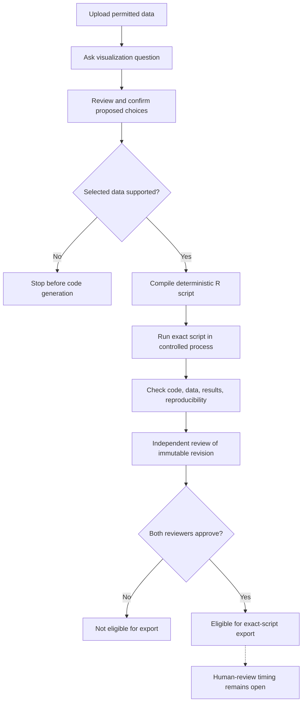

# First POC Workflow - Plan

## Goal Capsule

**Objective:** A clinical scientist can turn a question about permitted clinical data into a statistically appropriate, reproducible plot and exact R script for qualified human review.

**Means:** The workflow begins with data upload, then moves through question entry, plotting-choice confirmation, data validation, deterministic code generation, controlled execution, automated checks, independent review, and export.

**Product authority:** [Product strategy](../product/STRATEGY.md) and [Product Contract](../product/product-contract.md).

**Open blockers:** Define the first POC data and plot envelope. Resolve how reviewer decisions relate to export for human review and the draft-only export boundary.

## Product Contract

### Summary

Define the first upload-first clinical plot-generation workflow. The workflow connects permitted data, the scientist's question, confirmed plotting choices, exact executed R code, verification evidence, independent review, and export.

### Problem Frame

Clinical scientists move between general LLM chat and an R environment to execute, inspect, and refine plotting code. This slows iteration and leaves uncertainty about statistical appropriateness, reproducibility, and review readiness.

### Key Decisions

- **Both reviewer approvals gate export eligibility** (session-settled: user-directed — chosen over a single-reviewer gate: the requested workflow calls for independent decisions from both reviewer roles). Governs R9.

### Requirements

**Users and permitted inputs**

- R1. The primary user is a clinical scientist answering a regulatory or internal clinical question; statistical programmers and biostatisticians support review.
- R2. The POC accepts only public, synthetic, or properly de-identified data. Confidential patient-level data remain outside scope until the product and outputs are validated, privacy and security controls are qualified, and the client approves use.
- R3. The scientist begins the workflow by uploading permitted ADaM or tabular data, then asks a visualization question about that data.

**Plot choices and generation**

- R4. The application proposes plotting choices for the question, and the scientist reviews and confirms them before selected-data validation and code generation proceed.
- R5. The application validates the selected data and stops the workflow when it finds unsupported records, before code generation or plot execution.
- R6. A deterministic compiler generates R code from the confirmed specification.
- R7. The exact generated script runs in a controlled process to produce the plot.
- R8. Automated checks assess the code, data, results, and reproducibility and retain their outcomes with the revision.

**Review and export**

- R9. Independent reviewers assess an immutable revision. Both reviewers must approve before the revision is eligible for export.
- R10. An eligible export includes the exact R script used to produce its plot and supports human review. The timing of export relative to the two recorded review decisions remains unresolved.
- R11. If an unreviewed output is exported, it is labeled `Draft`. Unevaluated plot patterns are labeled `Experimental` or `Draft`.

**Traceability and status**

- R12. The workflow keeps the prompt, permitted input data, executed R code, visual output, review status, and validation evidence aligned.
- R13. The workflow records the package versions and execution environment needed to reproduce a reviewed output.

### Actors

- A1. **Clinical scientist:** Uploads permitted data, asks the plotting question, and reviews and confirms proposed choices.
- A2. **Statistical programmer:** Supports the scientist and independently reviews a revision.
- A3. **Biostatistician:** Supports the scientist and independently reviews a revision.
- A4. **Application:** Validates data, generates and executes code, records automated evidence, tracks revision state, and supports export.

Additional roles, permissions, and reviewer identity rules are not defined by the Product Contract.

### Key Flows

- F1. **Generate and review a plot**
  - **Trigger:** A clinical scientist starts with permitted data and a visualization question.
  - **Actors:** A1, A2, A3, A4.
  - **Steps:** Upload data; ask the question; review and confirm proposed plotting choices; validate selected data; compile and run the exact script; run automated checks; submit the immutable revision for independent review. Both approvals make a revision eligible for export. The exact placement of export relative to human review remains open.
  - **Covers:** R3-R10.
- F2. **Stop on unsupported data**
  - **Trigger:** Validation finds unsupported records in the selected data.
  - **Actors:** A1, A4.
  - **Steps:** Stop before code generation or plot execution. Show a failure state; its details and recovery path remain open.
  - **Covers:** R5.

### Acceptance Examples

- AE1. **Unsupported records:** Given selected data with unsupported records, when the application validates the data, it stops before compiling code or producing a plot. **Covers R5.**
- AE2. **Approval gate:** Given an immutable revision with fewer than two reviewer approvals, it is not eligible for export. When both independent reviewers approve, it becomes eligible; if exported, the export contains the exact executed script. **Covers R9, R10.**
- AE3. **Traceability:** Given a generated plot, a reviewer can associate it with the question, permitted input, confirmed choices, executed script, automated check outcomes, review status, and execution environment. **Covers R12, R13.**

### Success Criteria

- At least 80% of evaluated outputs pass statistical-programmer and biostatistician review without material correction.
- At least 80% of `Reviewed` outputs reproduce from recorded inputs, code, package versions, and execution environment.
- Median time from prompt submission to a `Verified` plot and reproducible R code is under one minute.
- Measure median time from `Verified` to `Reviewed` separately; set its target after the pilot establishes a baseline.

The strategy does not define the evaluation corpus, denominator, sample size, reviewer calibration, material-correction definition, exact reproducibility criteria, or benchmark conditions.

### Scope Boundaries

- The POC is limited to `ggplot2` visualization from permitted ADaM or tabular data; the exact supported data and plot envelope must be resolved before planning.
- Broader table, listing, and figure support is deferred until after the ggplot POC.
- The product is designed for validated clinical submission workflows. It does not imply direct FDA submission, FDA validation, or FDA approval.
- This contract defines workflow behavior only; visual layout, screen composition, and styling are out of scope.

### UX Risks

- The phrase "ADaM or tabular data" may lead scientists to expect broader support than the first POC provides; resolve the input envelope before planning.
- Scientists may confirm choices without understanding their effect on the selected data or plot; the choice set and its explanation remain open.
- A hard stop on unsupported records may leave the scientist unable to recover if diagnostics and next actions are not defined.
- Reviewers and scientists may confuse `Verified`, `Reviewed`, approved, and export-eligible because the status relationships and export timing are unresolved.

### Outstanding Questions

**Resolve Before Planning**

- What data structures, file formats, records, and plot patterns belong in the first POC envelope? Does the upload-first workflow replace or retain the earlier single BDS boxplot scope? The strategy and Product Contract do not define this boundary.
- Does export happen before the two review decisions as the reviewers' package, or after both approvals for further human review? How does the approval gate relate to draft-only exports allowed by the strategy?
- What are the entry criteria and transitions for `Draft`, `Experimental`, `Verified`, `Reviewed`, approved, and rejected revisions? What happens after rejection?

**Deferred to Planning**

- What are the exact automated checks and reproducibility pass criteria, and how will the strategy's evaluation metrics be measured?
- How does the application establish that uploaded data meet the POC permission and de-identification boundary?
- What failure diagnostics, recovery paths, loading limits, cancellation, and retry behavior apply to upload, validation, execution, checks, and export?
- What reviewer identity, role, and permission details are required, and what target environment and qualification evidence apply?
- What evidence retention period, data fields, and revision-to-export integrity details are required?
- What observed user example and current-workaround cost will anchor first-workflow evaluation?

### Sources / Research

- [Product strategy](../product/STRATEGY.md) defines the POC data boundary, user groups, trust priorities, metrics, and status vocabulary.
- [Product Contract](../product/product-contract.md) records the open questions about the POC envelope, metrics, and state transitions.
- [Earlier plot-pattern plan](2026-09-06-0014-feat-plot-pattern-assurance-cell-plan.md) describes a narrower visit-based BDS boxplot and an export matrix that includes `Draft`, `Verified`, and `Reviewed` revisions. Those choices are not carried forward where this brainstorm leaves the upload envelope or export rule open.
- [Current prompt module](../../R/mod_prompt.R) selects a synthetic BDS scenario and has no upload control; the upload-first requirement is a gap from current behavior.
