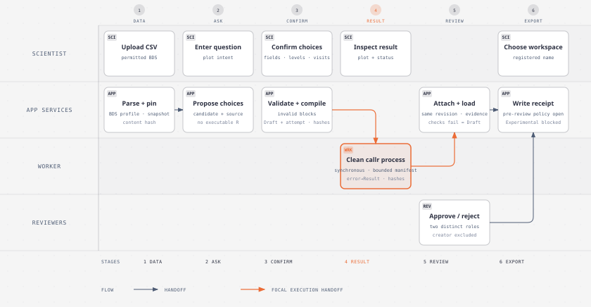
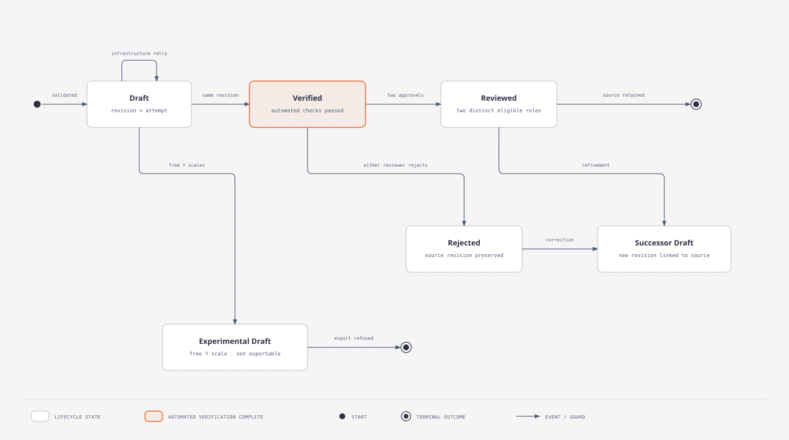

# First POC Workflow - Plan

## Goal Capsule

**Objective:** A clinical scientist can create a reviewable longitudinal ALT plot from permitted data and understand exactly which records and choices produced it.

**Means:** Extend the existing golem application and BDS boxplot assurance path with an upload-first, four-step workflow (KTD1-KTD6).

**Authority:** This plan follows the user's confirmed scope, then [Product strategy](../product/STRATEGY.md), [Product Contract](../product/product-contract.md), and [F001 UX specification](../ux/F001-plot-generation.md). Implementation must stop at any boundary below rather than infer a new product policy.

**Stop conditions:** Do not accept patient-level/confidential data, silently select records, generate code before the user confirms choices, create a result after blocking validation, or treat automated verification as human approval or system validation. The host must provide authenticated identity claims and deployment upload limits before release; provider selection is not part of the POC plan.

---

## Product Contract

### Summary

Build the first F001 workflow for a long-format BDS CSV and a treatment-faceted Tukey boxplot of ALT values by visit. Reuse the current deterministic compiler, statistics, revision, review, verification, and export services; implement the four-step Shiny workflow in the existing golem+bslib application. Do not add a dependency or create a separate application/module architecture.

### Problem Frame

Clinical scientists need a guided route from a clinical question to a plot whose record selection, statistics, code, checks, and review state can be inspected. The current POC has a synthetic BDS assurance flow but no CSV upload or F001 four-step workbench.

### Preservation Note

This plan resolves the earlier open first-POC envelope and brings F001 interaction design into scope. It retains the existing R1-R13 meanings where compatible, the two-reviewer gate for post-review export, the synthetic/de-identified boundary, and the existing boxplot assurance architecture; R3-R13 are made concrete for the selected BDS CSV workflow.

### Key Decisions

- **First input and plot envelope:** long-format BDS CSV plus the existing longitudinal Tukey boxplot pattern, using the ALT example (user-directed; selected over arbitrary tabular layouts and additional plot families). Governs R3-R8, R14-R15.
- **UI framework:** retain golem+bslib with existing Shiny modules (session-settled: user-directed; no teal or new dependency). Governs R14.
- **Review/export:** complete ordinary Draft and Verified bundles may be exported as drafts before human review; Reviewed exports require two independent approvals. Experimental/free-scale results are never exportable. The exported PNG and script omit lifecycle and reviewer data; the internal receipt remains linked to the revision (resolved from the Product Contract and user's workflow example). Governs R9-R11.

### Requirements

**Users and permitted inputs**

- R1. The clinical scientist is the primary user; a statistical programmer and a biostatistician independently review results.
- R2. The POC accepts only public, synthetic, or properly de-identified data. Uploading a file does not establish that it is permitted; the UI must state this boundary before selection and preserve the user's permitted-data attestation with the revision.
- R3. The scientist uploads one long-format BDS CSV containing at least `USUBJID`, `PARAMCD`, `AVALU`, `AVISIT`, `AVISITN`, a treatment variable such as `TRTA`, and numeric analysis values such as `AVAL`. The first example is ALT with Placebo and Drug 100 mg. Excel, arbitrary tabular shapes, and additional dataset families are outside this implementation.

**Intent, confirmation, and selection**

- R4. After upload, the scientist enters a plotting question. The intent interpreter may propose candidate choices and provenance only; it cannot supply executable R, confirm choices, change lifecycle state, or choose an export destination. Keep the existing interpreter seam and deterministic mock as the POC path until external model transport/retention terms are approved.
- R5. Before validation or compilation, the scientist confirms one eligible `PARAMCD`, one applicable `AVALU` where present, one numeric Y from `AVAL`, `CHG`, or `PCHG`, a treatment variable, included treatment levels and visits, and fixed or explicitly free Y scales. All eligible visits and treatment levels are initially included. Show whether each choice came from the prompt, input metadata, a governed default, or the user.
- R6. The workflow does not apply `ANL01FL`, population flags, or another hidden filter. It plots selected parameter records and stored values according to the confirmed choices. Missing selected Y values are excluded from statistics and distinct-subject N. Arbitrary R transformations are rejected/deferred.

**Validation, plot, and assurance**

- R7. Deterministic validation checks required fields and types, a single selected parameter/unit, deterministic visit ordering, supported treatment/visit selections, at least one nonmissing selected Y, and no duplicate `USUBJID`/`PARAMCD`/`AVISIT` keys after selections. A duplicate blocks compilation and execution; show authorized, ephemeral duplicate-key diagnostics and do not retain raw subject identifiers in durable evidence. Report blocking failures separately from warnings.
- R8. The confirmed specification feeds the existing deterministic compiler. Its exact UTF-8 script runs in a clean `callr` process and produces a treatment-faceted Tukey boxplot with visit order from `AVISITN`, type-7 quartiles, 1.5-IQR whiskers, visible outliers, connected medians, fixed shared Y scale by default, and a distinct-subject N strip. Free scales are an explicit Experimental/Draft choice.
- R9. Automated verification covers specification/script identity, pinned input identity/hash, independent statistics, plot layer data, output creation, recorded environment, and reproducible re-execution. A passing revision becomes `Verified — checks passed, awaiting human approval`; this does not mean human-approved, validated for intended use, or regulator-approved.

**Review, export, traceability, and workflow**

- R10. Review applies to an immutable revision. Two different authenticated people, neither the creator, must fulfill the statistical-programmer and biostatistician review roles before `Reviewed`. Rejection preserves the rejected revision; a correction creates a linked Draft successor. Reviewed revisions cannot be edited.
- R11. Export publishes exactly a PNG and the exact UTF-8 R script used to create it to a registered controlled-workspace name. A complete ordinary Draft or Verified bundle may be exported before human review, labeled as a draft in the app and export receipt. A Reviewed export requires both approvals. Experimental/free-scale results are not exportable. Exported files omit lifecycle status, reviewer identity, approval scope, prompt text, and internal evidence; the internal receipt links the export to its source revision. No arbitrary filesystem path is accepted.
- R12. Per F001 §11, retain and link the question and confirmed choices; permitted input identity/metadata; exact executed code; plot and analytical output; check and reproducibility evidence; lifecycle status and both reviewer decisions; package/environment details; and exported-script/revision identifiers. Never treat Shiny's temporary upload `datapath` as durable identity or evidence. Retention period, exact metadata set, identifier scheme, and integrity mechanism remain organization-level decisions.
- R13. Record package versions and execution environment needed to reproduce each revision. Preserve byte identity between the script recorded, executed, checked, and exported.
- R14. Present the workflow as four explicit steps: **Data → Ask → Confirm → Result**, with back navigation that returns to the current proposal. Use the named task-first workbench, data-profile side drawer, collapsible detail panels, and Draft badge. Collapsing details never skips validation or checks.
- R15. Show the configured low-N threshold and its authority, rationale, and version. The example uses 5 and warns when a cell has N < 5. The current code labels 5 as the Assurance Cell default; display it as sponsor-approved only when sponsor-approved metadata are actually supplied.

### Actors

- **A1 Clinical scientist:** supplies permitted CSV, asks the question, inspects provenance, and confirms choices.
- **A2 Statistical programmer:** reviews data interpretation, record selection, calculations, code, and reproducibility evidence.
- **A3 Biostatistician:** independently reviews statistical and clinical display choices.
- **A4 Application services:** parse/pin input, interpret intent, validate, compile, execute, verify, retain evidence, enforce lifecycle, and export.

### Key Flows

- **F1 Generate and review:** Data upload and pin → Ask → inspect candidate → Confirm → validate → compile and execute → show Draft result → automated checks → Verified → independent review → Reviewed after both approvals.
- **F2 Stop on unsupported structure:** Confirm → validation identifies a blocking issue (including duplicate selected keys) → show issue and recovery guidance → no compilation, execution attempt, plot, or Verified status.
- **F3 Revise and export:** a rejected or reviewed revision remains immutable; a correction creates a linked Draft. An authorized user selects a registered workspace name and exports the exact eligible PNG/script pair under the settled export policy.

### Acceptance Examples

- **AE1 ALT happy path:** Given the synthetic example and confirmed ALT/AVAL/U/L/TRTA/all treatments/all visits/fixed scale, the plot has Placebo N `5,5,5` and Drug 100 mg N `5,5,4`. The corresponding Q1/median/Q3 are Placebo `24/28/32`, `25/29/34`, `27/31/35`; Drug `25/29/33`, `22/25/28`, `19.25/21.5/23.75`. Drug Week 8 remains visible and is flagged low-N. D05's missing Week 8 AVAL is excluded from its cell's N and statistics.
- **AE2 Ambiguous choice:** If ALT has multiple units, or the prompt does not identify a parameter among eligible choices, stop at Confirm and ask the scientist to select one. Do not guess or execute.
- **AE3 Duplicate key:** If selected rows contain a second D03 ALT Week 4 record, show the duplicate key to an authorized user and stop before compilation. No script, plot, execution attempt, or Verified state is created.
- **AE4 No hidden filtering:** A record with `ANL01FL = "N"` remains eligible when it satisfies the explicitly confirmed selections; the application does not add a population or analysis-flag filter.
- **AE5 Verified and Reviewed distinction:** Passing all automated checks records Verified with the pending-human-approval label. Only both distinct eligible reviewers can create Reviewed; a rejection does not overwrite the revision.
- **AE6 Export identity:** An eligible export contains the exact executed UTF-8 R script and corresponding PNG and records identifiers linking both files to the source revision. Complete ordinary Draft and Verified bundles export only as drafts before review; Reviewed export requires both approvals. Experimental/free-scale output is refused.
- **AE7 Traceability:** A reviewer can trace the revision to the CSV snapshot hash and metadata, prompt, confirmed selection/provenance, exact code, plot/statistics, checks, environment, status, approvals, and any export receipt without exposing durable subject identifiers or a temporary upload path.

### Success Criteria

- At least 80% of evaluated outputs pass both review roles without material correction.
- At least 80% of `Reviewed` outputs reproduce from recorded inputs, code, package versions, and environment.
- Median prompt-to-Verified time is under one minute under a documented pilot environment and fixture.
- The example above matches independent expected statistics exactly within the declared numeric comparison tolerance; the duplicate and ambiguity cases block before compilation.

### Scope Boundaries

- First input profile: long-format BDS CSV using the selected BDS fields; first plot: longitudinal Tukey boxplot by treatment and visit.
- Keep current golem+bslib and current dependencies. No teal dependency, Excel parser, arbitrary CSV schema support, new plot family, arbitrary transformation language, or executable model-generated code.
- Only public, synthetic, or properly de-identified inputs. This POC subprocess boundary is for reliability, not a hostile-code sandbox or a qualified environment for approved clinical data.
- The POC is designed for validated clinical submission workflows; it is not FDA validated or FDA approved. Intended-use validation belongs to the regulated organization.
- Formal qualification, production identity integration, organization retention policy, and broader data/plot support remain outside this implementation except for the explicit integration seams and prerequisites below.

### Open Questions and Prerequisites

- **Host integration prerequisite for U5:** The deployment must inject a stable authenticated principal ID, active status, and role claims. Keep the app identity-provider-neutral; local actor/role selectors are demo behavior and cannot satisfy reviewer attribution.
- **Deployment prerequisite:** Set and document the target CSV upload-size ceiling through deployment configuration; no application `shiny.maxRequestSize` override was found. Do not imply arbitrary file size.
- **Policy prerequisite:** Use low-N threshold 5 as the existing Assurance Cell default and label its authority accordingly. Supply sponsor-approved policy metadata only if the sponsor requires a different threshold.
- **Deferred:** Organization retention duration, final metadata/identifier/integrity policy, formal qualification evidence, evaluation cohort/calibration details, and operational retry/timeout/cancellation limits.

---

## Planning Contract

### Key Technical Decisions

- KTD1. **Snapshot the upload immediately.** Validate extension and content server-side, parse the CSV on the server, validate the minimum structure, and pin an immutable session-owned snapshot with a content hash before moving past Data. Store the normalized snapshot/metadata, not Shiny's temporary `datapath`; set an explicit deployment upload-size ceiling. Follow the [Shiny fileInput reference](https://shiny.posit.co/r/reference/shiny/latest/fileinput.html), which treats the upload path as temporary and the browser `accept` value as a hint rather than validation.
- KTD2. **Extend the existing BDS profile.** Reuse `validate_bds_profile()`, `local_study_data_provider()`, the deterministic statistics, compiler, and assembly path. Generalize the treatment-variable contract to include `TRTA` while retaining existing `TRT01A` fixtures. Do not build a second analytics path. (session-settled: user-directed — chosen over a new plot architecture: reuse the existing boxplot assurance path; R3-R8)
- KTD3. **Use explicit step state in existing bslib modules.** Keep navigation linear and stateful; back navigation restores the current proposal. The data profile is an initially closed, discoverable side drawer with aggregate schema/quality summaries. Confirmed controls remain authoritative. Follow the four-step, drawer, task-first, collapsible-panel, and Draft-badge solution notes linked below. (session-settled: user-directed — chosen over teal or a new dependency: retain golem+bslib; R14)
- KTD4. **Preserve non-executable intent interpretation.** Keep the provider-neutral candidate contract and deterministic mock. The compiler accepts only confirmed structured fields. The optional ellmer transport stays disabled until the existing retention, training, region, transport, and incident terms are approved.
- KTD5. **Separate subprocess execution from durable writes.** Capture immutable request inputs and persist the Draft revision/attempt before synchronous invocation. Use the existing clean-callr path and make the subprocess return a bounded result manifest only. The application/service process validates the returned identity, attaches result evidence to that revision, and promotes it after checks. This is a reliability boundary, not a security sandbox.
- KTD6. **Reuse review/evidence/export services with authenticated identity and shared revision lookup.** Store revisions and artifacts under a stable app-scoped repository root visible to all user sessions; the current per-execution temporary root cannot support two reviewers loading the same revision. Keep revision lifecycle, immutable evidence, independent role checks, and workspace registration. Replace caller-entered actor identity with a host-authenticated principal carrying stable ID, active status, and role claims. Apply the settled export policy: complete ordinary Draft and Verified bundles export as drafts before review; Reviewed exports require both approvals; Experimental/free-scale results are excluded. Provider-specific configuration and shared storage must come from the host deployment; multi-instance deployment remains outside this POC.

### High-Level Technical Design

#### End-to-end workflow

[Open the full-size workflow diagram](diagrams/first-poc-workflow.html).

_Fidelity: the original 20 workflow nodes and 27 connections are grouped into six stages and four responsibility lanes. Blocking validation, hash-bound execution, bounded subprocess results, same-revision verification, two-person review, and the open pre-review export policy remain visible._

#### Revision lifecycle

[Open the full-size revision lifecycle diagram](diagrams/first-poc-revision-lifecycle.html).

_Fidelity: all six lifecycle states and ten transitions from the source are retained._

The upload profile drawer shows column names/types, row and missingness counts, available parameter/unit/treatment/visit choices, and validation summaries. Do not render raw subject identifiers in persistent profile/evidence. Duplicate keys may be shown as short-lived diagnostics only to authorized users.

### System-Wide Impact and Risks

- **Data lifecycle:** Shiny upload files are temporary, and the POC handles only permitted data. U1 must snapshot before later steps; evidence references the pinned hash, not a path or raw subject identifiers.
- **Execution state:** a subprocess can fail or time out. U4 binds the result to immutable request hashes and leaves durable writes to the application process.
- **Identity and export:** local demo selectors cannot establish real reviewer identity. U5 depends on a host identity provider and an explicit pre-review export policy.
- **Deployment:** CSV size limits and workspace registration are host configuration. The default Shiny upload limit must not be mistaken for an approved product limit.
- **Assurance:** the clean subprocess is not a security sandbox, and passing automated checks does not qualify the system for regulated use.

---

## Implementation Units

Keep changes in current files/modules. Add tests to current test files/fixtures; do not scaffold a new package, app, or module architecture.

#### U1. CSV ingest and pinned BDS snapshot

**Goal:** Make the concrete long-format CSV profile an authorized, reproducible input to the existing assurance path.

**Requirements:** R2-R3, R7, R12-R13, R15.

**Dependencies:** None.

**Files:** `R/provider_study_data.R`, `R/provider_study_data_local.R`, `R/bds_profile.R`, `R/mod_prompt.R`, `R/app_server.R`; `tests/testthat/test-provider-study-data.R`, `tests/testthat/test-provider-contracts.R`, `tests/testthat/test-bds-profile.R`, `tests/testthat/test-mod-prompt.R`.

**Approach:** Parse and pin once at upload; record byte/content hash, parser settings/version, safe file metadata, and classification attestation. Validate server-side; do not trust filename extension or browser accept. Add `TRTA` as an eligible treatment variable. Preserve existing manifest-backed synthetic fixtures and BDS duplicate behavior. Set an explicit maximum upload size after target deployment configuration is supplied.

**Scenarios:** valid synthetic BDS CSV; malformed/header-only CSV; missing required columns; type/parse failure; repeated upload changes snapshot identity; temporary `datapath` disappears with no impact; forbidden data attestation blocks progression; oversized file is refused; `TRTA` and current `TRT01A` fixtures both work.

**Verification:** focused provider/profile tests and browser upload flow; assert retained evidence uses snapshot identity/hash and never the temp path.

#### U2. Four-step workbench and inspectable candidate

**Goal:** Guide the scientist through Data → Ask → Confirm → Result with visible, editable choices.

**Requirements:** R4-R5, R14.

**Dependencies:** U1.

**Files:** `R/app_ui.R`, `R/app_server.R`, `R/mod_prompt.R`, `R/mod_specification.R`, `R/mod_plot_preview.R`, `inst/app/www/app.css`; `tests/testthat/test-mod-prompt.R`, `tests/testthat/test-mod-specification.R`, `tests/testthat/test-app-browser.R`.

**Approach:** Recompose the existing modules in place. Track one active step explicitly; preserve entered prompt and choices when moving back. Render provenance beside fields, the initially closed profile drawer, collapsible details, and the Draft badge. Show pending, success, and failure states inline on the active step: upload/parse failure stays on Data with re-upload available; blocking validation stays on Confirm with the choice that needs correction identified; execution or verification failure stays on Result with Draft status and a clear recovery action. Retry only an infrastructure execution failure against the same confirmed request; a changed choice creates a successor revision. Always run validation and checks regardless of panel state.

**Scenarios:** next/back preserves edits; missing/ambiguous parameter or unit requests a user decision; upload, validation, execution, and verification pending/error/success states preserve current inputs and offer only valid recovery; user changes confirmed choices and provenance updates; keyboard step changes move focus to the new step heading; drawer open/close manages focus and returns it to the trigger; blocking and lifecycle updates are announced to assistive technology; narrow viewports retain access to required actions and plot details; collapse/expand does not alter validation state.

**Verification:** module tests for state/provenance and `shinytest2` browser coverage for upload-to-confirm, recoverable failures, keyboard focus and announcements, drawer focus return, accessible labels, and narrow viewport usability.

#### U3. Confirmed BDS selection and longitudinal boxplot result

**Goal:** Compile only the confirmed selection into the existing deterministic Tukey boxplot path.

**Requirements:** R5-R8, R15.

**Dependencies:** U1 and U2.

**Files:** `R/bds_profile.R`, `R/boxplot_statistics.R`, `R/boxplot_compiler.R`, `R/boxplot_assembly.R`, `R/app_server.R`; `tests/testthat/test-bds-profile.R`, `tests/testthat/test-boxplot-statistics.R`, `tests/testthat/test-boxplot-compiler.R`, `tests/testthat/test-boxplot-assembly.R`, `tests/testthat/fixtures/expected-boxplot-statistics.csv`.

**Approach:** Validate the selected parameter/unit/Y/treatment/visit set after confirmation. Preserve no-hidden-filter behavior and missing-Y rules. Ensure treatment variable is a confirmed compiler input. Use type-7 quartiles, 1.5-IQR whiskers, visible outliers, connected medians, shared scale by default, explicit free-scale experimental state, and N strip. Show low-N authority/version with warning at `< 5` for the supplied example; do not call the default sponsor-approved.

**Scenarios:** exact AE1 statistics; missing D05 Week 8; duplicate key blocks; multiple units/parameters prompt selection; all selected visits/groups retained; explicit exclusions applied; no `ANL01FL` filter; free scales get Experimental/Draft and no export eligibility.

**Verification:** compare analytical result and ggplot layer data to the independent fixture; verify script identity from the confirmed specification.

#### U4. Synchronous execution, verification, and evidence boundary

**Goal:** Persist a Draft revision and execution attempt before running the exact script synchronously, then attach accepted results to that same revision before automated promotion.

**Requirements:** R8-R9, R12-R13.

**Dependencies:** U1 and U3.

**Files:** `R/execution_service.R`, `R/execution_runner.R`, `R/execution_runner_callr.R`, `R/artifact_store_local.R`, `R/evidence_repository_sqlite.R`, `R/app_server.R`, `R/revision_evidence.R`, `R/verification_service.R`; `tests/testthat/test-execution-runner-callr.R`, `tests/testthat/test-verification-service.R`, `tests/testthat/test-revision-evidence.R`, `tests/testthat/test-app-smoke.R`.

**Approach:** After deterministic validation and compilation, create the immutable Draft revision, store its exact script, and persist the execution request/attempt before invoking the clean subprocess synchronously. Include specification hash, script hash, snapshot ID/hash, renderer settings, and environment version in the request. The subprocess returns a bounded result manifest and never writes lifecycle or evidence storage. The application service checks returned identities, attaches output/evidence to the already-created revision, and runs mandatory checks; passing checks promote that same revision from Draft to Verified. Subprocess or verification failure leaves the revision Draft with its failure evidence and no Verified status. Keep Experimental/Draft separate and ineligible for promotion/export. Bind each result to the captured request to prevent stale or duplicate completion from updating another revision.

**Scenarios:** Draft and execution attempt exist before execution; exact script equals compiled/stored/executed/exported script; changed snapshot or script hash blocks Verified; subprocess error/timeout leaves the same Draft and records failure without losing the attempt; successful checks promote that same revision; failed checks never promote; stale/double result cannot overwrite current revision; Experimental/Draft is not auto-promoted; clean rerun matches expected values.

**Verification:** synchronous app-server and callr contract tests, verification/evidence tests, then existing app smoke/browser flow. This does not qualify the subprocess as a hostile-code sandbox.

#### U5. Authenticated review, lifecycle, and controlled export

**Goal:** Connect the existing review/export workflow to authenticated actors and keep revisions immutable.

**Requirements:** R10-R13, F3; requires host-supplied authenticated identity claims and the registered controlled-workspace configuration.

**Dependencies:** U4 and host identity/workspace integration.

**Files:** `R/mod_review.R`, `R/review_service.R`, `R/lifecycle_service.R`, `R/mod_export.R`, `R/export_service.R`, `R/provider_workspace.R`, `R/app_server.R`; `tests/testthat/test-review-service.R`, `tests/testthat/test-lifecycle-service.R`, `tests/testthat/test-mod-review.R`, `tests/testthat/test-export-service.R`, `tests/testthat/test-mod-export.R`, `tests/testthat/test-app-export-browser.R`.

**Approach:** Resolve the requested revision ID from the stable app-scoped SQLite evidence repository and artifact store so separate authenticated sessions load the same immutable specification, code, plot, and evidence. Inject a stable principal ID, active status, and roles from the hosting application; remove user-editable reviewer identity and role selectors as authority. Require two different active reviewers, correct review roles, and creator exclusion. Preserve rejected revisions and create successor Drafts. Use only registered workspace names. Export complete ordinary Draft and Verified bundles as drafts before review; require both approvals for Reviewed export; refuse Experimental/free-scale output. Export the exact PNG plus UTF-8 script without lifecycle/reviewer metadata in the files and retain linked internal receipt metadata.

**Scenarios:** two separate authenticated sessions load the same revision and evidence; unauthenticated/ineligible/creator/same-person reviewer blocked; either role rejection preserves revision; both roles approve Reviewed; reviewed edit refused; correction creates a linked successor; arbitrary path rejected; export bytes match revision; complete ordinary Draft/Verified bundles export as drafts; Reviewed export requires both approvals; Experimental/free-scale output is blocked.

**Verification:** service-level lifecycle/export tests, browser review/export journey with two separately authenticated test sessions loading the same revision, and inspection that export receipts link immutable source hashes.

---

## Verification Contract

Implementation must use the repo's configured `testthat` suite (`Rscript -e 'testthat::test_local(reporter = "summary")'`, as used by CI), focused existing test files per unit, and `shinytest2` for upload/navigation/review/export browser behavior. Run the package check with `devtools::check(error_on = "warning")`, which is the check recorded in `docs/validation/test-evidence.md`. The repository's [CI workflow](../../.github/workflows/R-CMD-check.yaml) runs the local test suite. Do not count static inspection as runtime/browser evidence.

Required evidence:

1. U1 provider/profile checks plus browser upload: server-side rejection cases, pinned snapshot hash, no dependency on temporary upload path.
2. U2 module and browser checks: Data → Ask → Confirm → Result, back navigation, ambiguity handling, profile drawer, keyboard navigation.
3. U3 independent expected-statistics and plot-layer comparison for AE1; duplicate and missing-value cases.
4. U4 Draft-before-execution, exact code/data hash, callr outcome, failure evidence, same-revision promotion, stale-result cases, automated verification and clean rerun.
5. U5 shared revision lookup across two authenticated sessions, two-person review lifecycle, and exact-pair export under the settled policy and host identity claims.
6. Full package test/check; manual visual comparison with [F001 prototype](../ux/F001-plot-generation-prototype.html), accessibility review, and target-environment evidence. The manual/browser/target-environment results must be reported separately from unit-test success.

No tests are run as part of this planning pass.

---

## Definition of Done

- The existing app presents the four F001 steps and uses only the selected BDS CSV / ALT Tukey boxplot envelope.
- A permitted CSV is parsed and pinned before progression; metadata and hashes are traceable without retaining Shiny's temporary path.
- The Meera example produces the exact N/quartile/median values in AE1; Week 8 Drug low-N is visible, and missing Y does not count.
- Ambiguities require user choice, duplicate selected keys block before compiler/executor, and hidden population/analysis filters are absent.
- The compiler accepts only confirmed choices; the exact script executed is byte-identical to the revision and any export.
- The app-scoped repository records Draft and an execution attempt before execution; the clean subprocess returns bounded results without direct lifecycle/evidence writes; the app service attaches them and promotes that same revision only after verification passes.
- Draft, Verified, Reviewed, Experimental, rejection, successor, and immutability behavior is explicit and tested; `Verified` is not presented as human or regulatory approval.
- Section 11 traceability fields are linked to the revision and protected from raw-ID/temp-path leakage.
- Separate authenticated sessions load the same immutable revision and evidence from app-scoped storage; review/export uses host-authenticated principals and the explicit workspace registry. The Draft/Verified export policy is settled; deployment must provide its identity claims, upload ceiling, and shared storage configuration before release.
- No new package dependency or separate app/module architecture is introduced; abandoned implementation attempts are removed.
- Focused tests, configured full suite/check, browser evidence, manual design/accessibility review, and unverified limitations are reported accurately.

---

## Appendix

### Research and Existing Patterns

- [F001 specification](../ux/F001-plot-generation.md) and [prototype](../ux/F001-plot-generation-prototype.html) define the workflow and visual reference; F001 §11 defines the evidence linkage.
- [Four-step wizard flow](../solutions/four-step-wizard-flow.md): linear Data → Ask → Confirm → Result, with back navigation and validation gates.
- [Data profile side drawer](../solutions/data-profile-side-drawer.md): initially closed but discoverable profile details that support selection without displacing the task.
- [Collapsible panel pattern](../solutions/collapsible-panel-pattern.md): optional detail visibility does not make required processing optional.
- [Draft status badge](../solutions/draft-status-badge.md): concise Draft indicator and clear status explanation.
- [Task-first clinical plot workbench](../solutions/design-patterns/task-first-clinical-plot-workbench.md): task-oriented plot canvas and result review.
- [Earlier plot-pattern assurance plan](2026-09-06-0014-feat-plot-pattern-assurance-cell-plan.md): existing BDS validation, type-7 statistics, review lifecycle, and export patterns to reuse.
- Existing implementation touchpoints: `R/app_ui.R`, `R/app_server.R`, `R/mod_prompt.R`, `R/mod_specification.R`, `R/provider_study_data.R`, `R/provider_study_data_local.R`, `R/bds_profile.R`, `R/boxplot_statistics.R`, `R/boxplot_compiler.R`, `R/boxplot_assembly.R`, `R/revision_evidence.R`, `R/review_service.R`, and `R/export_service.R`.
- [Shiny fileInput reference](https://shiny.posit.co/r/reference/shiny/latest/fileinput.html): upload paths are temporary and server-side checks are required. [bslib reference](https://rstudio.github.io/bslib/): use installed Bootstrap 5 components and the existing app theme.
- Current project code resolves numeric threshold 5 to `Assurance Cell default`; sponsor-approved metadata are required for a different value (`R/bds_profile.R`).
