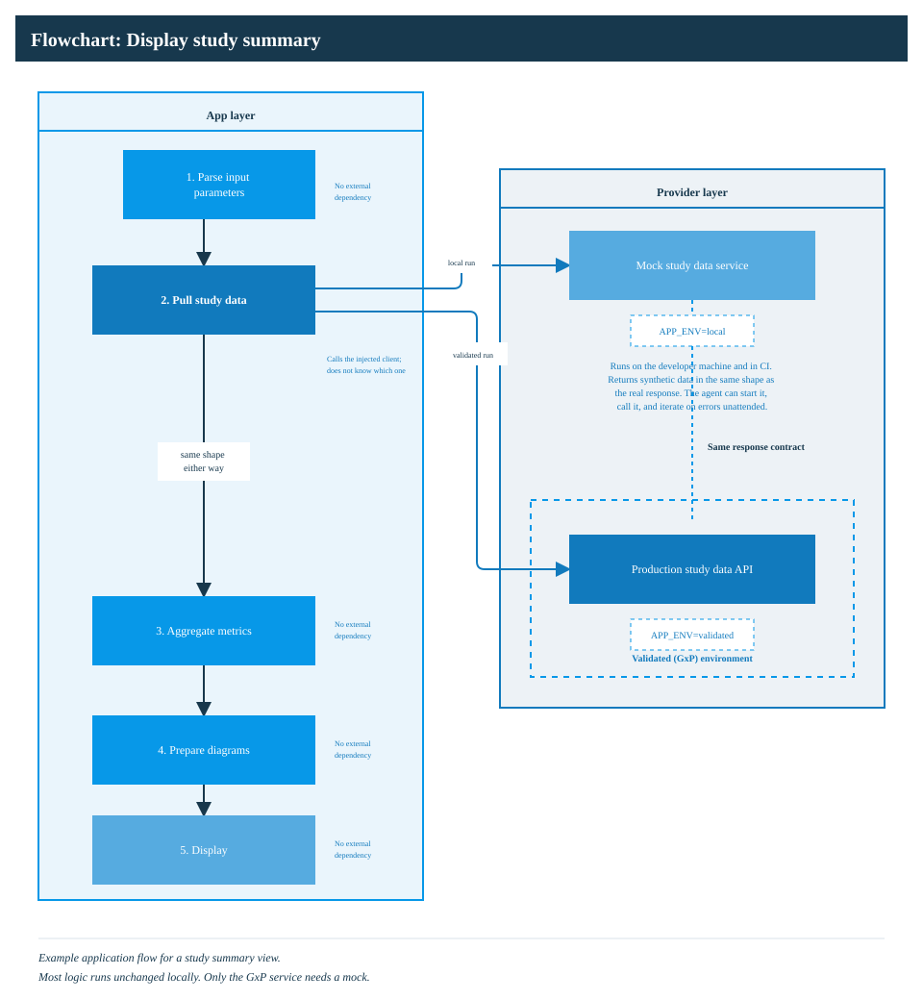

# GxP Coding-Agent Guidance

## Source

Project reference derived from the user-supplied article **“GxP Isn't Limiting
Your Coding Agent. Your Setup Is.”** The author, publication, and canonical URL
were not included with the supplied text and should be added when available.

This document captures engineering guidance for ADaMViz SubmissionSync. It is
not a regulation, validation standard, quality-system procedure, or validation
artifact.

## Core guidance

### Require questions instead of invented assumptions

Coding agents can produce code that builds and runs while relying on unstated
business or environmental assumptions. In a validated workflow, every invented
branch becomes code that must be reviewed, tested, maintained, and justified.

Project rule:

> Make no extra assumptions about the business logic or target environment. Do
> not change requirements or existing interfaces, install new packages, or add
> custom error handling. Ask the user first if any of these changes appear
> necessary.

Record material assumptions, decisions, and requirement clarifications in a
reviewable artifact rather than leaving them only in a chat transcript.

### Make the product runnable outside the validated environment

Keep application logic independent of environment-specific services. Treat
databases, APIs, model providers, and validated platforms as replaceable backing
services selected through configuration.

- Inject service clients rather than constructing them inside business logic.
- Provide contract-compatible local mocks for inaccessible GxP services.
- Keep the same application path for local and validated execution wherever
  practical; swap only the configured dependency.
- Prevent local or test configuration from reaching production services.
- Verify mocks against versioned service contracts and representative failure
  modes.

Local execution improves agent effectiveness, but it does not replace testing
in the qualified target environment.

*Figure: Example application flow for a study summary view. Most of the logic
runs unchanged locally. Only the GxP service needs a mock.*

### Use governed synthetic data

Development and automated tests should use public, synthetic, or properly
de-identified data unless use of confidential data is explicitly approved under
applicable organizational controls.

Synthetic ADaM, SDTM, analysis-results data, and TLF fixtures should:

- conform to a documented schema and controlled terminology where applicable;
- include intentional boundary, missingness, longitudinal, and cross-domain
  cases needed by the requirements;
- carry provenance, generator version, random seed, and scenario identifiers;
- be checked for accidental inclusion or reconstruction of real participant
  data;
- remain clearly labeled as synthetic and unsuitable as clinical evidence.

Synthetic data supports development coverage; it cannot demonstrate behavior
against all real-study variation. Controlled testing with approved data remains
necessary before a validated release.

### Treat tests and documentation as executable context

Tests tell both reviewers and coding agents what the software is required to
do. Documentation identifies relevant architecture, supported paths, dead
paths, available commands, and which dependencies are real or mocked.

- Trace requirements to risk controls, tests, results, and reviewed evidence.
- Test requirements and risks, not merely current implementation details.
- Require documentation updates when public interfaces or intended behavior
  change.
- Run coverage and other agreed quality gates in CI, but do not use coverage
  percentage as a substitute for risk-based test adequacy.
- Keep agent instructions, local-run commands, mock boundaries, and prohibited
  actions current and review them like code.
- Require qualified human review of agent-drafted tests and expected results.

## Application to ADaMViz SubmissionSync

Use the following evidence states consistently:

- **Exploratory:** generated code or output has not completed defined review and
  verification.
- **Verified:** specified checks passed in the recorded environment; this does
  not imply the product or workflow is validated.
- **Validated for intended use:** approved requirements, risk assessment,
  traceability, test evidence, deviations, environment qualification, and
  authorized release records collectively support the defined intended use.

For every generated visualization, retain enough information to reproduce and
review the result: prompt and requirement context, permitted input provenance,
input schema and integrity checks, generated and executed R code, dependency
versions, execution environment, warnings and errors, output artifact hashes,
test results, reviewer decisions, and status history.

## Build checklist

- [ ] Intended use, users, environment, and prohibited uses are documented.
- [ ] Business rules and interfaces are explicit; unresolved gaps stop the
      affected work for clarification.
- [ ] External services are injected and have contract-compatible mocks.
- [ ] Local runs cannot access confidential data or production services by
      default.
- [ ] Synthetic fixtures cover requirement-driven normal, boundary, and failure
      scenarios and have recorded provenance.
- [ ] Requirements, risks, controls, tests, results, and reviewer approvals are
      traceable.
- [ ] CI executes agreed static checks, tests, documentation checks, and evidence
      capture in a reproducible environment.
- [ ] Target-environment testing is separately planned and recorded.
- [ ] Agent-produced code and tests receive qualified human review.
- [ ] Draft, verified, and validated states are visibly and technically
      distinct.
- [ ] Changes to requirements, models, prompts, packages, data contracts, or
      execution environments follow controlled change management.

## Important limitation

Good modularity, mocks, synthetic data, tests, documentation, and agent
guardrails make validation feasible and auditable. They do not by themselves
validate a product. Validation must be based on the defined intended use,
applicable regulations and organizational procedures, documented risk controls,
objective evidence, and authorized human approval.
