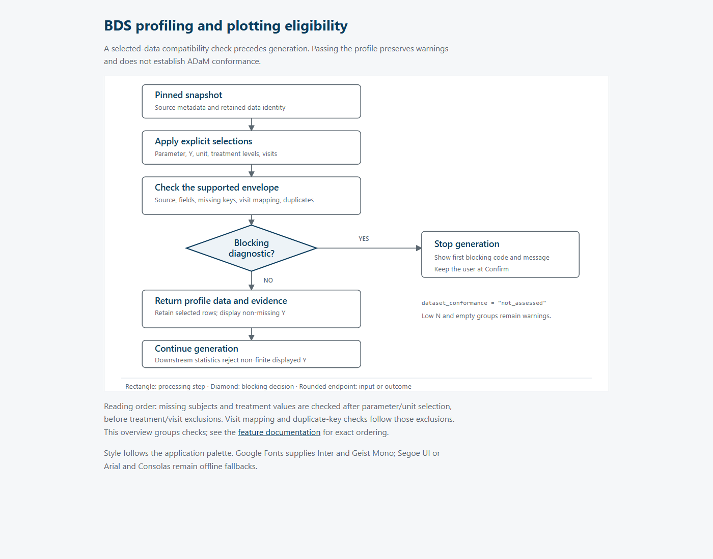

The application checks whether selected records support its longitudinal numeric BDS boxplot before generating a result. Passing this check establishes compatibility with one plotting pattern. The result explicitly records `dataset_conformance = "not_assessed"`; it does not establish full ADaM conformance, data provenance, or statistical suitability for an intended clinical analysis.

[View in Full Screen](https://htmlpreview.github.io/?https://raw.githubusercontent.com/Ramdhadage/ADaMViz.SubmissionSync/master/vignettes/articles/diagrams/02-bds-profiling-eligibility.html)

## Two checks with different scope

The upload adapter, `.uploaded_study_data_provider()` in [mod_plot_generation.R](https://github.com/Ramdhadage/ADaMViz.SubmissionSync/blob/master/R/mod_plot_generation.R), checks the parsed file before creating a provider. It requires populated records, unique non-empty column names, and `USUBJID`, `PARAMCD`, `PARAM`, `AVISIT`, `AVISITN`, `AVAL`, and `AVALU`. Both `AVAL` and `AVISITN` must be numeric. At least one treatment column must match `^TRT(A|P|[0-9]+[AP])$`, covering names such as `TRTA`, `TRTP`, `TRT01A`, and `TRT01P`. Selectable parameters, names, units, visits with finite order values, and treatment values must exist somewhere in the file. This is a whole-file admission check, rather than a complete validation of every row. Wide-format visit columns receive guidance to reshape into long format; the adapter does not reshape them.

`validate_bds_profile()` in [bds_profile.R](https://github.com/Ramdhadage/ADaMViz.SubmissionSync/blob/master/R/bds_profile.R) then evaluates a pinned snapshot and six selections: `paramcd`, `y_variable`, `unit`, `treatment_variable`, `treatment_levels`, and `visits`. The parameter and treatment variable must each be one non-empty string. The selected Y variable must be `AVAL`, `CHG`, or `PCHG` and numeric. Its required columns are `USUBJID`, `PARAMCD`, `AVISIT`, `AVISITN`, the selected Y column, and the selected treatment column. `AVALU` is used when present. Consequently, the upload requirements are stricter than this lower-level profile API.

## How selections affect checking

The profile first requires BDS source metadata. A classified snapshot must be public, synthetic, or deidentified. A snapshot without classification is accepted only when its source is `direct_upload`. Direct-upload metadata therefore permits profiling without proving that the data meet the permitted-data policy.

The chosen treatment variable must belong to the snapshot's permitted catalog, and the parameter must exist. The profile selects that parameter and discovers its non-missing units. Multiple units require an explicit choice; an unavailable choice blocks. Selecting a unit removes records with another unit or a missing unit. With no explicit unit and at most one discovered unit, the API does not apply a unit filter. Confirmation has its own completeness requirements in [domain_plot_spec.R](https://github.com/Ramdhadage/ADaMViz.SubmissionSync/blob/master/R/domain_plot_spec.R).

Missing or empty subject identifiers and treatment values block at this point, **before** treatment-level and visit exclusions. Treatment choices default to all available levels when `NULL`. Explicit levels must be unique, non-missing, and available; the resulting order follows the sorted available levels rather than the order supplied by the caller.

Visit exclusions precede mapping and duplicate checks. Missing visit labels are deliberately retained during this filtering so they can trigger a diagnostic. Every retained visit label must map to exactly one non-missing `AVISITN`, and each order value to exactly one label. Visits are ordered by `AVISITN`, then label. Requested visits must still exist after parameter, unit, and treatment selection.

Duplicate `USUBJID`–`PARAMCD`–`AVISIT` keys block. If duplicates coexist with additional declared keys beyond `STUDYID`, `USUBJID`, `PARAMCD`, `AVISIT`, and `AVISITN`, the diagnostic is `unsupported_additional_timepoint_keys`; otherwise it is `unsupported_duplicate_visit_key`. Legitimate within-visit timepoints remain outside this cell's supported envelope. Neither diagnostic declares the source invalid ADaM.

## Retained records, displayed records, and warnings

A successful profile returns sorted `selected_data` and `display_data`. Selected records retain missing Y values; display records exclude them. Stored `CHG` and `PCHG` values are used directly. The profile does not derive them or silently apply `SAFFL` or analysis flags such as `ANL01FL`.

For each displayed treatment–visit combination, `source_n` counts distinct selected subjects and `n` counts distinct subjects with non-missing Y. The default sparse-data threshold is `n < 5`. A different threshold requires a list containing a finite value of at least one, rationale, authority, and version. The API retains these fields; it does not authenticate sponsor approval.

Low N, combinations with no non-missing Y, and entirely empty included treatment levels produce nonblocking warnings. Empty groups do not receive invented observations or count rows; included facet and visit levels remain explicit. The analytical input hash covers normalized display records, selections, facet levels, visit levels, and the retained low-N policy.

## Blocking behavior and enforcement limits

The profile stops at the first blocking diagnostic. Compact durable diagnostics contain a code, message, and optional count and integrity reference. Duplicate subject keys are returned separately in `authorized_diagnostics`, rather than embedded in durable diagnostic text.

The confirmation handler displays the blocking code and message and remains at Confirm. The execution coordinator, `.execute_assurance_revision()` in [app_server.R](https://github.com/Ramdhadage/ADaMViz.SubmissionSync/blob/master/R/app_server.R), also checks the profile before compilation. Numeric type alone is insufficient: the profile can retain infinite Y values, while `calculate_boxplot_statistics()` in [boxplot_statistics.R](https://github.com/Ramdhadage/ADaMViz.SubmissionSync/blob/master/R/boxplot_statistics.R) rejects non-finite displayed values downstream. Profiling success therefore does not guarantee that generation or execution will succeed.

## Coverage and verification status

[test-bds-profile.R](https://github.com/Ramdhadage/ADaMViz.SubmissionSync/blob/master/tests/testthat/test-bds-profile.R) contains cases for metadata, required fields, explicit units, absent keys, numeric Y, visit conflicts, duplicates, additional timepoint keys, exclusions, unchanged analysis flags, missing-Y counts, empty facets, row-order stability, and retained low-N policy. These tests were inspected, not executed for this documentation change. No R execution, browser behavior, statistical review, or formal validation is claimed here.
